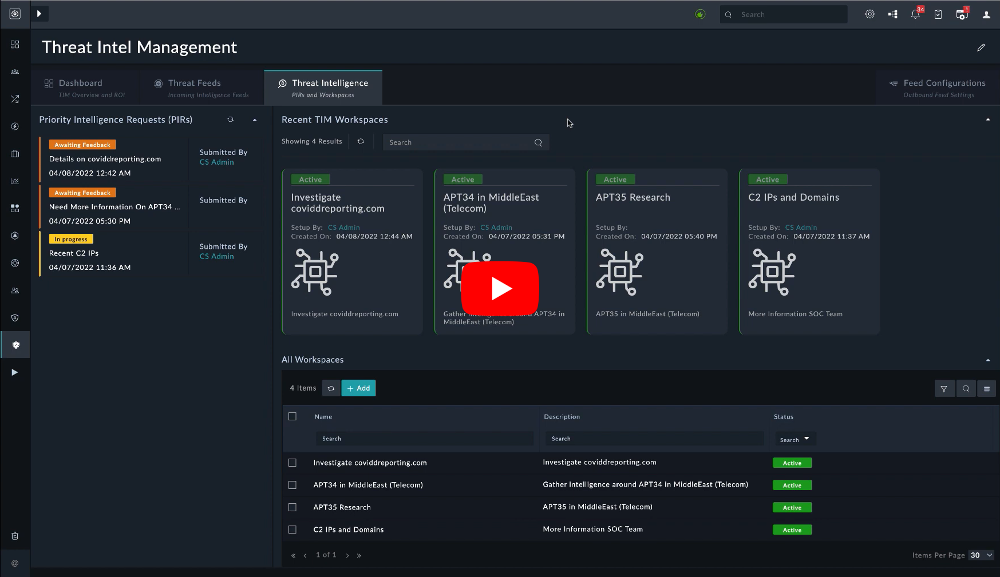

# Release Information

- **Version**:  1.2.2
- **Certified**: Yes
- **Publisher**: Fortinet
- **Compatible Version**: FortiSOAR v7.2.0 and later
- [Release Notes](./release_notes.md)

# Overview

Modern cybersecurity challenges are largely about persistent, smart, and well-armed threat actors, an overload of security alerts, false alarms (aka Alert Fatigue), disparate security systems, and a dearth of skilled professionals. A well-designed Threat Intelligence Framework (powering a practice) helps to mitigate these challenges. A lot of organizations are either not able to find time or energy to invest in incorporating one in their processes and some are unsure of the best practices to implement one. Often, we hear of organizations struggling after incorporating multiple threat intelligence data feeds, and later realizing that it just adds salt to misery. Contextual, actionable threat intelligence is the key, and the FortiSOAR threat intelligence solution, fueled by the threat intelligence lifecycle, is built on that premise. It is purpose-built for threat intelligence teams, as it is contextual, collaboration-friendly, and easily understood, it allows for preparing actionable and timely intelligence, and most importantly, it is evolving in nature, such that it eventually meets its requirements.

>*Threat intelligence is evidence-based knowledge, including context, mechanisms, indicators, implications, and action-oriented advice about an existing or emerging menace or hazard to assets. This intelligence can be used to inform decisions regarding the subject’s response to that menace or hazard.*
>
>~ Source, Gartner 

The FortiSOAR Threat Intelligence Solution is delivered as a solution pack through the [FortiSOAR Content Hub](https://fortisoar.contenthub.fortinet.com/), as this allows for quicker updates and a more collaborative canvas for management and pack maintenance. In its first avatar, it ships in the **Preview** mode, and is aimed to collect feedback and understand ways in which threat intelligence teams would like to use it in their day-to-day investigation processes.

The Threat Intelligence Management Solution Pack gathers raw data about emerging or existing threat actors and threats from several sources. The solution pack then analyzes and filters this data to produce threat intelligence feeds and reports that contain information to help automate security control solutions.

Check the following video demonstration of the Threat Intelligence Management solution:

|  |
|:--------------------------------------------------------------------------------------------------------:|
|             [FortiSOAR Threat Intel Management](https://www.youtube.com/watch?v=vTvtHQxniVU)             |

## Features

The Threat Intelligence Management Solution Pack has the following features:

- **Aggregation of intelligence from multiple sources** - A mature threat intelligence platform consumes and correlates data from external and internal sources, providing threat intelligence analysts with more comprehensive insights into known or suspected threats. The feeds can be structured (STIX, CSV) or unstructured (PDF threat reports).

- **Curation, normalization, enrichment, and risk scoring of data**: Many of the inputs to a threat intelligence platform can be duplicate, no longer malicious, or not enough of a threat to merit action. Threat Intelligence Platforms (TIP) have machine-learning algorithms to sort the information and weigh the individual indicators of compromise (IOCs) based on a multitude of factors that are relevant to cyber threats. Curated indicators appear in an easy-to-read format with a risk score and associated intelligence.

- **Integration**: TIPs act as an intermediary between information and your existing security solutions, eliminating the need to configure a connection manually. Various systems process these indicators as follows:
    - Firewalls and intrusion detection systems receive indicators for active blocking;
    - SIEMs and endpoint solutions correlate these indicators against available information to prioritize alerts
    - Orchestration platforms to use these indicators to improve workflows.  
      The flexibility of these integrations rapidly improves the ability of a security team to identify and counter threats. This holds true whether an organization’s security stack is entirely cloud-based, on-premises, or any combination of the two.

- **Analysis and sharing of threat intelligence**: Securely sharing threat intelligence creates more comprehensive, reliable outputs that help analysts quickly respond to threats. Threat actors reuse many of their techniques, tactics, procedures, and strategies to target similar organizations and infrastructures. Comprehensive information and context around malicious actors make it quicker and easier for your security team to prevent them from doing significant harm.

# Next Steps

| [Installation](./docs/setup.md#installation) | [Configuration](./docs/setup.md#configuration) | [Usage](./docs/usage.md) | [Contents](./docs/contents.md) |
|----------------------------------------------|------------------------------------------------|--------------------------|--------------------------------|
