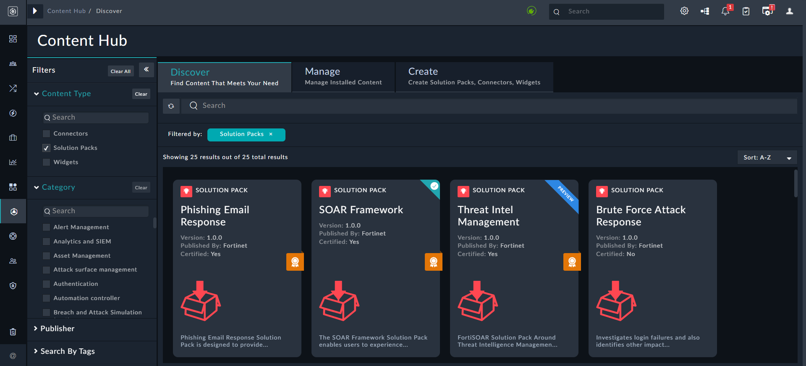
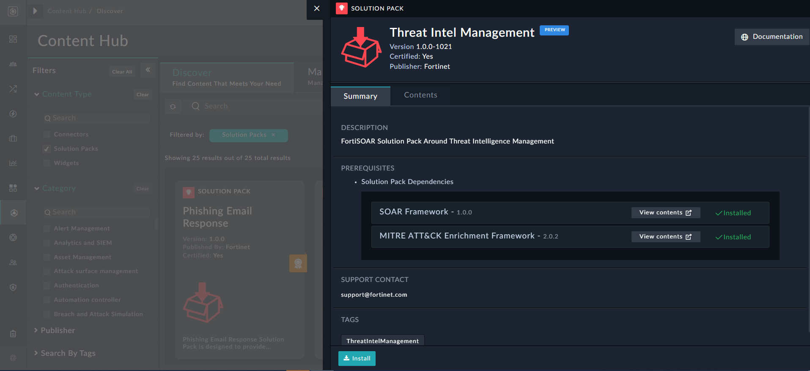
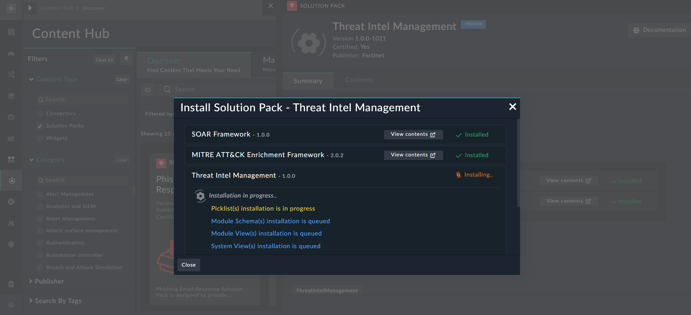
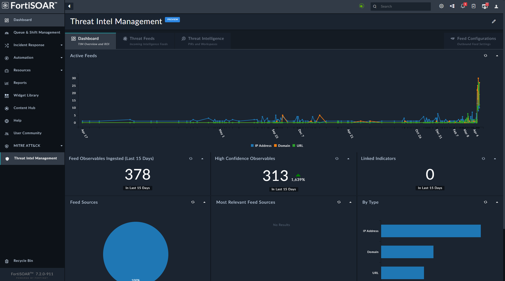
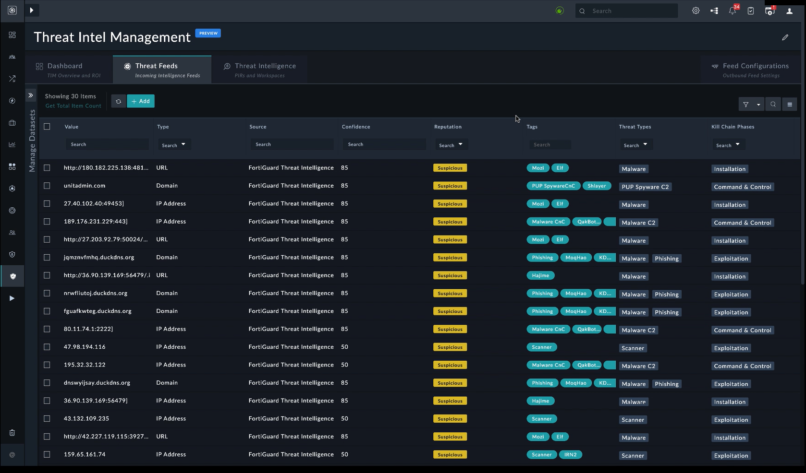
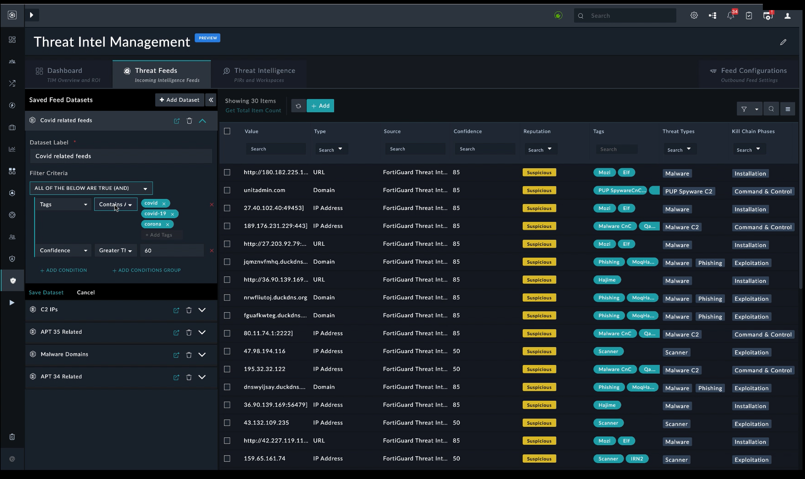
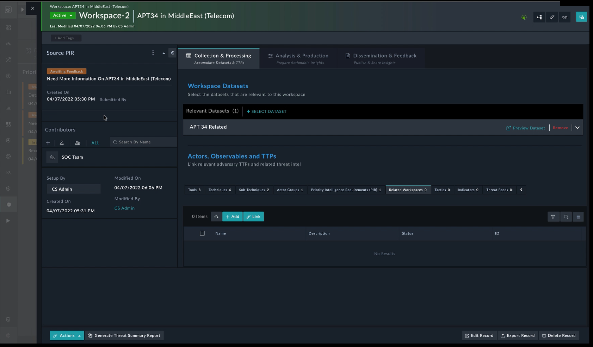
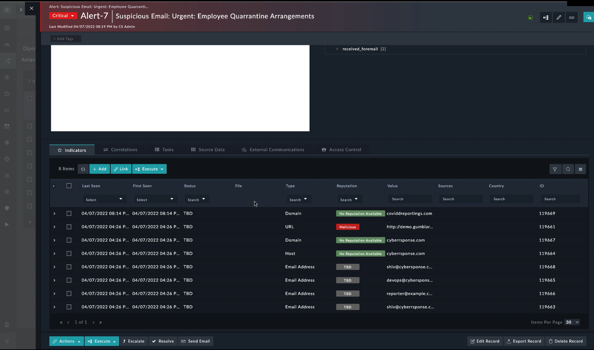
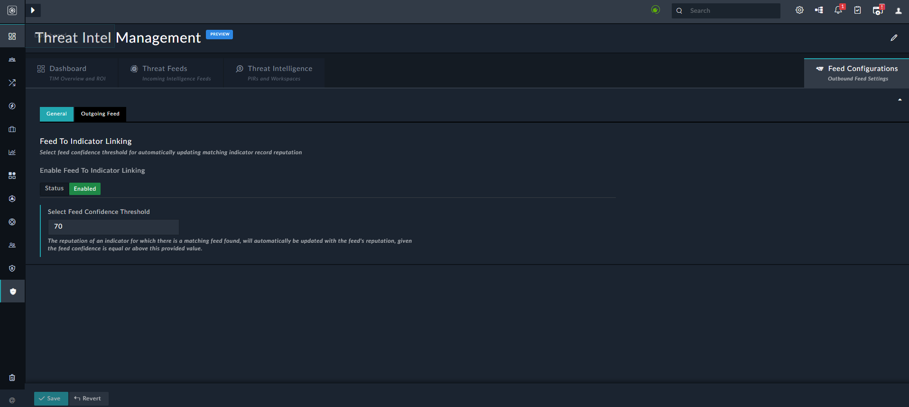
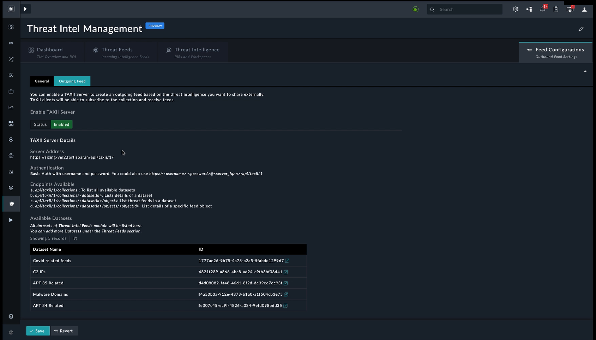

# Threat Intel Management Solution Pack

## Release Information
- Solution Pack Version: 1.0.0
- FortiSOAR™ Version Tested on: 7.2.0
- Authored By: Fortinet
- Certified: Yes

## Overview

Modern cybersecurity challenges are largely about persistent, smart, and well-armed threat actors, an overload of security alerts, false alarms (aka Alert Fatigue), disparate security systems, and a dearth of skilled professionals. A well-designed Threat Intelligence Framework (powering a practice) helps to mitigate these challenges. A lot of organizations are either not able to find time or energy to invest in incorporating one in their processes and some are unsure of the best practices to implement one. Often, we hear of organizations struggling after incorporating multiple threat intelligence data feeds, and later realizing that it just adds salt to misery. Contextual, actionable threat intelligence is the key, and the FortiSOAR threat intelligence solution, fueled by the threat intelligence lifecycle, is built on that premise. It is purpose-built for threat intelligence teams, as it is contextual, collaboration-friendly, and easily understood, it allows for preparing actionable and timely intelligence, and most importantly, it is evolving in nature, such that it eventually meets its requirements.

*“Threat intelligence is evidence-based knowledge, including context, mechanisms, indicators, implications, and action-oriented advice about an existing or emerging menace or hazard to assets. This intelligence can be used to inform decisions regarding the subject’s response to that menace or hazard.”* — Source, Gartner 

The FortiSOAR Threat Intelligence Solution is delivered as a solution pack through the [FortiSOAR Content Hub](https://fortisoar.contenthub.fortinet.com/), as this allows for quicker updates and a more collaborative canvas for management and pack maintenance. In its first avatar, it ships in the “Preview” mode, and is aimed to collect feedback and understand ways in which threat intelligence teams would like to use it in their day-to-day investigation processes.

The Threat Intelligence Management Solution Pack gathers raw data about emerging or existing threat actors and threats from several sources. The solution pack then analyzes and filters this data to produce threat intelligence feeds and reports that contain information to help automate security control solutions.

## Features

The Threat Intelligence Management Solution Pack has the following features:

- **Aggregation of intelligence from multiple sources** - A mature threat intelligence platform consumes and correlates data from external and internal sources, providing threat intelligence analysts with more comprehensive insights into known or suspected threats. The feeds can be structured (STIX, CSV) or unstructured (PDF threat reports).
- **Curation, normalization, enrichment, and risk scoring of data**: Many of the inputs to a threat intelligence platform can be duplicate, no longer malicious, or not enough of a threat to merit action. Threat Intelligence Platforms (TIP) have machine-learning algorithms to sort the information and weigh the individual indicators of compromise (IOCs) based on a multitude of factors that are relevant to cyber threats. Curated indicators appear in an easy-to-read format with a risk score and associated intelligence.
- **Integration**: TIPs act as an intermediary between information and your existing security solutions, eliminating the need to configure a connection manually. Various systems process these indicators as follows:
    - Firewalls and intrusion detection systems receive indicators for active blocking;
    - SIEMs and endpoint solutions correlate these indicators against available information to prioritize alerts
    - Orchestration platforms to use these indicators to improve workflows.  
      The flexibility of these integrations rapidly improves the ability of a security team to identify and counter threats. This holds true whether an organization’s security stack is entirely cloud-based, on-premises, or any combination of the two.
- **Analysis and sharing of threat intelligence**: Securely sharing threat intelligence creates more comprehensive, reliable outputs that help analysts quickly respond to threats. Threat actors reuse many of their techniques, tactics, procedures, and strategies to target similar organizations and infrastructures. Comprehensive information and context around malicious actors make it quicker and easier for your security team to prevent them from doing significant harm.

## Prerequisites

Threat Intel Management (TIM) Solution Pack requires the following solution packs to be pre-installed:

- SOAR Framework
- MITRE ATT&CK Enrichment Framework

Apart from the above mandatory solution packs, it is also highly recommended that threat intelligence teams (you) configure the MITRE ATT&CK connector and set up its ingestion to ensure that ATT&CK data gets ingested into your system. It is recommended to schedule the ingestion of data once a month. For more information, see the MITRE ATT&CK connector documentation on the [FortiSOAR Connectors](https://docs.fortinet.com/fortisoar/connectors) page.

## Contents

This section lists the various contents of the SOAR Framework Solution Pack. 

### Module Schemas

- Tasks
- Workspaces
- Threat Intel Feeds

### System Views

- **Navigation** - Threat Intel Management

### Module Views

- **Workspaces** - List, Detail, Form, Settings
- **Threat Intel Feed** - List, Detail, Form, Settings

### Global Variables

- Indicator_Feed_Reputation_Preference

### Connectors

- Fortinet FortiGuard Threat Intelligence
- MalSilo

### Widgets

- Card Tiles
- Task Management
- Manage Datasets
- Access Control
- Feed Configuration Settings

### Playbook Collections

- 10 - SP - TIM Automation

### Reports

- Threat Intel Summary Report

### Roles

- Full App Permissions
- SOC Manager
- Threat Intel Management

### Picklists

- IndicatorReputation
- TaskStatus
- TaskType
- ThreatIntelFeedType
- TrafficLightProtocol
- Workspace Status
- KillChainPhases
- Threat Type

## Use Case Scenarios

### Threat Feed Management and FortiGuard Integration

Using comprehensive, ingestion-friendly feed integrations for multiple paid and open-source third-party feeds (available in FortiSOAR Content Hub), threat intelligence teams can now ingest varied feed data and manage them in a normalized, single pane of glass using the 'Threat Feeds' Module. The solution provides multiple ways to  manage this volume of data by parameters such as feed & source confidence, TLP, Severity, Expiry/Age, etc. Additionally, the solution allows to create feed datasets to filter and group relevant feeds for use in sharing, exporting, or eventually as useful data reference while creating contextual threat intelligence. 

Another big value addition of the solution is its comprehensive integration with FortiGuard, Fortinet’s flagship threat intelligence source. As part of FortiSOAR TIM Solution, you get unlimited lookups into the rich FortiGuard threat intel database and an ability to ingest its valuable daily threat intelligence feed. In the 'Preview' mode, you can ingest a maximum of 100 feeds daily.

### Collaborative Framework To Create & Consume Actionable Threat Intelligence

Both Incident response teams and organization members in and outside the SOC (executives, stakeholders, management) can raise Priority Intelligence Requirement (PIR) requests, that drive threat intelligence-gathering efforts. The process starts with – any SOC member raising a PIR with "*I need more information around this area/problem/artifact/actor, etc*", followed by the SOC/threat intel team setting up Workspaces in the Framework. A workspace is a goal-driven canvas that allows teams to dive into different phases of the threat intelligence lifecycle (direction, data collection, processing, analysis, dissemination, and feedback) to curate and share the process outcome with the stakeholder who asked for information. Threat feeds and datasets, MITRE ATT&CK Framework’s rich actor (tactics, techniques, tools, etc.) information and integration fuels FortiSOAR's automation engine, and FortiSOAR's multi-dimensional correlation framework, forms a great combination of the right data sources and tools to start one’s research. 

### Sharing Threat Intelligence

The ability to generate and share the threat intelligence report with stakeholders enables making research actionable. A feedback loop is incorporated into the process to ensure the research meets the expected outcomes and allows for a dialogue between the request initiator (PIR owner) and the research team for getting close to the goal. 

Additionally, the solution allows sharing of threat feeds and datasets over standard STIX/TAXII protocols for getting them across to products that can benefit from these threat feeds and datasets. For example, you can set up a TAXII server in FortiSOAR to broadcast relevant malicious and high confidence feed datasets to a SIEM product such as Fortinet FortiSIEM, that will eventually use them to enhance detection rules and lookup watchlists. These datasets could also be sent using different integrations to update specific watchlists in these products.

### Indicators to Feed Relationships

The solution is intelligent to auto-link malicious feeds with good confidence (configurable) with an indicator in the product and if asked for, also update the indicator reputation. Such built-in intelligent workflows allow consumption of the feed intelligence and enhance the quality of daily investigations. There are several other handles, configurations, and options provided to manage the relationship between indicators and feeds in terms of the feed confidence, sightings, similarities, and other parameters. 

## Information Flow

### Installation of the Threat Intel Management Solution Pack

1. On the FortiSOAR left navigation, click **Content Hub**.
2. On the `Content Hub` page, from the **Filter** panel choose **Solution Packs** to view the list of all currently available solution packs:  
   
3. Click the **Threat Intel Management** (TIM) card to display the TIM popup:  
   
4. Ensure that the prerequisites to installing the TIM solution pack are met. If yes, click **Install** to install the same.  
     
   Once the TIM solution pack is installed, you will observe that the all the contents and entities associated with the TIM solution pack are installed, for example, the addition of the Threat Intel Management module and its link added to the left navigation, etc.  
   

## Threat Intel Management Flow

Once the TIM solution pack is installed, you must configure your threat intelligence feeds connectors such as Fortinet FortiGuard Threat Intelligence, Anomali Limo Threat Intel Feed, Cisco Talos Feed, MITRE ATT&CK, etc. based on your requirements, and then start ingesting data from these sources. For information on how to configure feed connectors, see the connector documentation on the [FortiSOAR Connectors](https://docs.fortinet.com/fortisoar/connectors) page.

### Dashboards

Once you have set up data ingestion and are ingesting feeds from various sources, click **Threat Intel Management** in the left navigation to view the `Dashboard` page:  

The `Dashboard` provides you with insights into the ROI, effectiveness of ingestion, ingestion rates of feeds, how many observables were ingested, how many of the ingested observables got linked to indicators, relevance of the feed sources, etc. These metrics enable you to decide which threat feeds are worth monitoring and the performance of the various threat feeds.

### Threat Feed Management

Using a wide variety of Feed integrations that are available on the 'Content Hub', you can seamlessly ingest feeds and get a normalized and aggregated view of the feeds on the **Threat Feeds** tab:  

Threat Feeds solution is well architected to handle scale at one end and effectively manage feeds at the other. You can manage feeds with the help of parameters such as feed sources, their confidence, TLPs, expiry, etc.

The noise associated with the feeds is the main hurdle with managing feeds and with deriving utility from the feeds, therefore, as a first-level of filtration, the TIM solution allows you to create 'Datasets'. To view datasets, click the **Manage Datasets** arrow to view the created datasets or to add new datasets:  

For example, let's look at the Covid-related feeds dataset. In the covid-related feeds, you can apply the first-level filtration, by choosing some tags that are of interest, and also specify the confidence level of over 60. This filtration would eliminate those feeds that do not contain the specified tag and whose confidence level is lesser than 60, thereby helping to eliminate some of the noise:  

Similarly, you can create multiple datasets based on your goals or filtration requirements, and use them while you are creating actionable threat intelligence. 

### Threat Intelligence Workflow 

The **Threat Intelligence** tab is the cornerstone of the TIM solution as alone threat feeds can often prove to be a burden on the threat intelligence team and analysts when there is no clear picture of what to consume and what to leave. On the Threat Intelligence tab you can create and consume actionable and contextual threat intelligence:  

A quick example of creating a threat intelligence workflow can be a management request to the threat intelligence team for information on a particular threat actor group, for example, APT 34 in the Middle East and the Telecom sector. Once the threat intelligence team gets this request, they can create a 'Workspace' in the **Recent TIM Workspaces** section as follows:   

As you can see the threat intelligence team has defined a workspace APT in MiddleEast (Telecom). The 'Workspace' contains a **Source PIR** section in which the PIR is linked automatically and in which the threat intelligence team can add more contributors allowing for comprehensive research. Also, the Workspace is split into various phases aligned to the Threat Intelligence Lifecycle, where the first stage is collecting and processing data, followed by analyzing the data, and then finally sharing the actionable insights to the stakeholders using reports, etc.

On the **Collection & Processing** tab, you can use the datasets that you have created or you can add new datasets in the **Workspace Datasets** section. You can add or link a variety of correlations feed from the MITRE ATT&CK intelligence Framework around its techniques, sub-techniques, tools, etc, or can be associated with vulnerabilities, indicators, notes, etc.  

After you have collected the data, you can start analyzing the data on the **Analysis & Production** tab, where you look at how various components are correlated, etc. You can also jot down your finding in **Notes**:  

If you have a wider team to do analyzes, you also have **Task Management** available, using which you can assign tasks to various team members  

Once you are done with your analysis, you move on to the **Dissemination & Feedback** tab, where you can share your findings with a larger audience.  

You can generate a threat summary report of your finding by clicking the **Generate Threat Summary Report** button:  

In the Generate Threat Summary Report popup, you can choose various options such as adding a comment to the Workspace and PIR with the report attached for feedback, updating the PIR task status to 'Awaiting Feedback', and you can also assign the task back to the person who raised the request for feedback. Clicking **Generate Threat Intel Summary Report** generates the report and sends it to the team members. This also starts the feedback loop, which if actionable, leads to improvement in the detection rules, or other areas of improvement.

There are other ways in which threat intelligence teams interact with Workspaces'. For example, there can be a request to the threat intelligence team from the management to monitor all alerts that contain 'Covid' correlations and provide threat intelligence insights related to these correlations. Now, if the team receives the following 'Phishing' alert that contains 'Covid' correlations:  

Now, for this phishing alert, the team requires to get more intelligence around the URL in the 'Covid' correlation that does not contain reputation information (`No Reputation Available`) from the standard enrichment sources. So then, you can select that correlation and click **Execute** and choose the **Raise Priority Intelligence Requirement Request (PIR)** playbook:  

Clicking  **Raise Priority Intelligence Requirement Request (PIR)**  displays a  **Raise Priority Intelligence Requirement Request (PIR)**  popup, in which you can specify the details of the PIR and then click Submit PIR Request To Threat Intel Team. This in turn submits the PIR to the threat intelligence team and they create the required workspace such as 'Investigatecovidreporting.com'. Next, the threat intelligence team can start investigating the URL, find related IPs, run whois analysis, etc., and then add all the relevant items and sent this information back to the 'Firewall' team, which starts the feedback loop and dialog between teams, making detection and prevention more effective.

### Feed Configurations

On the **Feed Configurations** tab, on the **General** tab, you can configure the feed confidence threshold to automatically update the matching indicator record reputation. In this case, the reputation of an indicator that has a matching feed gets automatically updated with the reputation of the feed, provided the confidence of the feed is equal or above to the value specified in the Selected Feed Confidence Threshold field (70% in our example):  

On the **Outgoing Feed** tab, you can configure standard ways to share threat feeds data, by clicking Enable on the Outgoing Feed tab and then configure a TAXII server so that any other platform having STIX/TAXII capabilities can consume this data:  
 

Apart from this, you can also use standard ways to export a CSV file so that other tools can import and use the filtered threat intelligence data.  

## Additional Resources

### Videos

To view a video demonstration for the Threat Intelligence Management solution click [here](https://www.youtube.com/watch?v=vTvtHQxniVU).
