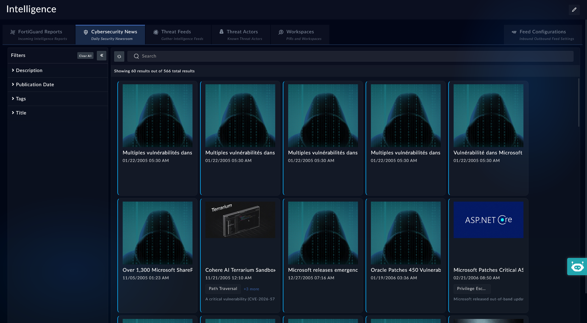

| [Home](../README.md) |
|----------------------|

# Cybersecurity News

1. In the left navigation pane, go to <picture><source media="(prefers-color-scheme: dark)" srcset="./res/icon-threat-intel-management-light.svg"><source media="(prefers-color-scheme: light)" srcset="./res/icon-threat-intel-management-dark.svg"></picture> **Threat Intel Management** <picture><source media="(prefers-color-scheme: dark)" srcset="./res/icon-chevron-light.svg"><source media="(prefers-color-scheme: light)" srcset="./res/icon-chevron-dark.svg"></picture> <picture><source media="(prefers-color-scheme: dark)" srcset="./res/icon-threat-intelligence-light.svg"><source media="(prefers-color-scheme: light)" srcset="./res/icon-threat-intelligence-dark.svg"></picture> **Hub**.

2. Select the tab **Cybersecurity News**.

    

3. Click any of the cards to view details.

You can flag the news cards with any of the following:

- **New**: The news has not been opened

- **Processing**: The news is under review

- **Red Flag**: The news may be a cause of concern

- **Read**: The news has been read

## Filters

You can filter the news based on the following parameters:

- **Description**: Specify strings to retrieve the news tiles that contain the specified words in the tiles' *description*

- **Publication Date**: Select a date range or specify a custom date to retrieve news tiles from that date range

- **Tags**: Specify tags to retrieve news tiles associated with the searched tag.

- **Title**: Specify strings to retrieve the news tiles that contain the specified words in the tiles' *title*

# Next Steps

| [Installation](./setup.md#installation) | [Configuration](./setup.md#configuration) | [Contents](./contents.md) |
|-----------------------------------------|-------------------------------------------|---------------------------|
