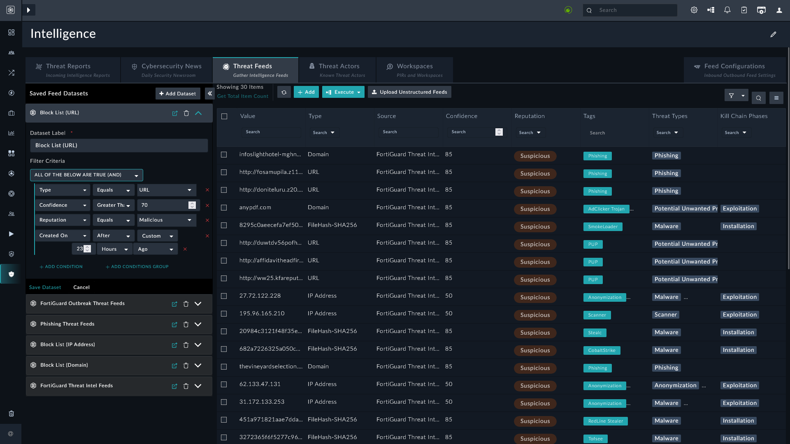

| [Home](../README.md) |
|----------------------|

# Working with Datasets

*Threat Intel Management* allows you to create **Datasets**. The **Manage Datasets** arrow <picture><source media="(prefers-color-scheme: dark)" srcset="./res/icon-collapse-light.svg"><source media="(prefers-color-scheme: light)" srcset="./res/icon-collapse-dark.svg"></picture> can be used to hide, and bring into view, the datasets created out-of-the-box, or to add new datasets:

## Adding a Dataset

You can create a different dataset from the feeds to filter unwanted noise:

1. Navigate to <picture><source media="(prefers-color-scheme: dark)" srcset="./res/icon-threat-intel-management-light.svg"><source media="(prefers-color-scheme: light)" srcset="./res/icon-threat-intel-management-dark.svg"></picture> **Threat Intelligence** <picture><source media="(prefers-color-scheme: dark)" srcset="./res/icon-chevron-light.svg"><source media="(prefers-color-scheme: light)" srcset="./res/icon-chevron-dark.svg"></picture> <picture><source media="(prefers-color-scheme: dark)" srcset="./res/icon-threat-intelligence-light.svg"><source media="(prefers-color-scheme: light)" srcset="./res/icon-threat-intelligence-dark.svg"></picture> **Hub**.

2. Click the tab **Threat Feeds**.

    

3. Click the button <picture><source media="(prefers-color-scheme: dark)" srcset="./res/icon-add-light.svg"><source media="(prefers-color-scheme: light)" srcset="./res/icon-add-dark.svg"></picture> **Add Dataset**, under the tab **Threat Feeds**.

4. Enter the **Dataset Label** and **Filter Criteria** to filter the targeted dataset.

5. Click **Save Dataset**.

## Editing a Dataset

You can edit an existing dataset to view feeds that meet certain criteria:

1. Navigate to <picture><source media="(prefers-color-scheme: dark)" srcset="./res/icon-threat-intel-management-light.svg"><source media="(prefers-color-scheme: light)" srcset="./res/icon-threat-intel-management-dark.svg"></picture> **Threat Intelligence** <picture><source media="(prefers-color-scheme: dark)" srcset="./res/icon-chevron-light.svg"><source media="(prefers-color-scheme: light)" srcset="./res/icon-chevron-dark.svg"></picture> <picture><source media="(prefers-color-scheme: dark)" srcset="./res/icon-threat-intelligence-light.svg"><source media="(prefers-color-scheme: light)" srcset="./res/icon-threat-intelligence-dark.svg"></picture> **Hub**.

2. Click the tab **Threat Feeds**.

3. Click <picture><source media="(prefers-color-scheme: dark)" srcset="./res/icon-chevron-down-light.svg"><source media="(prefers-color-scheme: light)" srcset="./res/icon-chevron-down-dark.svg"></picture> against a dataset to expand it.

    

4. Edit the filter criteria.

5. Click **Save Dataset**.

## Deleting a Dataset

You can delete an existing dataset to remove the filter conditions that are no longer relevant.

1. Navigate to <picture><source media="(prefers-color-scheme: dark)" srcset="./res/icon-threat-intel-management-light.svg"><source media="(prefers-color-scheme: light)" srcset="./res/icon-threat-intel-management-dark.svg"></picture> **Threat Intelligence** <picture><source media="(prefers-color-scheme: dark)" srcset="./res/icon-chevron-light.svg"><source media="(prefers-color-scheme: light)" srcset="./res/icon-chevron-dark.svg"></picture> <picture><source media="(prefers-color-scheme: dark)" srcset="./res/icon-threat-intelligence-light.svg"><source media="(prefers-color-scheme: light)" srcset="./res/icon-threat-intelligence-dark.svg"></picture> **Hub**.

2. Click the tab **Threat Feeds**.

3. Click <picture><source media="(prefers-color-scheme: dark)" srcset="./res/icon-delete-light.svg"><source media="(prefers-color-scheme: light)" srcset="./res/icon-delete-dark.svg"></picture> against a dataset to delete it.

# Next Steps

| [Installation](./setup.md#installation) | [Configuration](./setup.md#configuration) | [Contents](./contents.md) |
|-----------------------------------------|-------------------------------------------|---------------------------|
