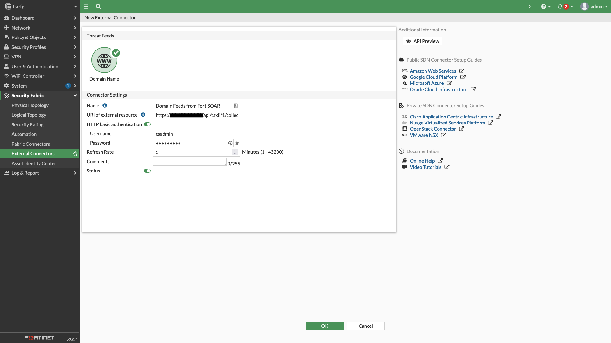

| [Home](../README.md) |
|----------------------|

# Examples

The following example explains how to export CSV fields from the TAXII server and import using FortiGate.

## Export CSV Fields to FortiGate

FortiGate accepts CSVs containing only the `value` field.

1. Create a dataset. For information on how to create a dataset, refer to the section [Adding a Dataset](./datasets.md#adding-a-dataset).

2. Under <picture><source media="(prefers-color-scheme: dark)" srcset="./res/icon-threat-intel-management-light.svg"><source media="(prefers-color-scheme: light)" srcset="./res/icon-threat-intel-management-dark.svg"></picture> **Threat Intelligence** <picture><source media="(prefers-color-scheme: dark)" srcset="./res/icon-chevron-light.svg"><source media="(prefers-color-scheme: light)" srcset="./res/icon-chevron-dark.svg"></picture> <picture><source media="(prefers-color-scheme: dark)" srcset="./res/icon-threat-intelligence-light.svg"><source media="(prefers-color-scheme: light)" srcset="./res/icon-threat-intelligence-dark.svg"></picture> **Hub**, click the **Feed Configurations** tab.

2. Under the **Feed Configurations** tab, click **TAXII Server**. Ensure that it is enabled.

3. Scroll down to the section **Available Datasets**.

4. Click <picture><source media="(prefers-color-scheme: dark)" srcset="./res/icon-csv-light.svg"><source media="(prefers-color-scheme: light)" srcset="./res/icon-csv-dark.svg"></picture> against your dataset to copy the dataset CSV endpoint URL.

5. Append `$__selectFields=value` to get only values.

>[!Tip]
>Refer to the section [Using API Key for TAXII Server Authentication](#using-api-key-for-taxii-server-authentication) for information on using API key for authentication via Postman.

### Import in FortiGate

1. Log in to FortiGate.
2. Go to **Security Fabric > External Connectors**.
3. Create new Threat Feed connector.
4. Use CSV endpoint URL (containing only values) with FortiSOAR credentials.
5. Set refresh rate and enable.

### View Entries

Check **View Entries** in FortiGate connector to confirm imported values.

# Next Steps

| [Installation](./setup.md#installation) | [Configuration](./setup.md#configuration) | [Contents](./contents.md) |
|-----------------------------------------|-------------------------------------------|---------------------------|
