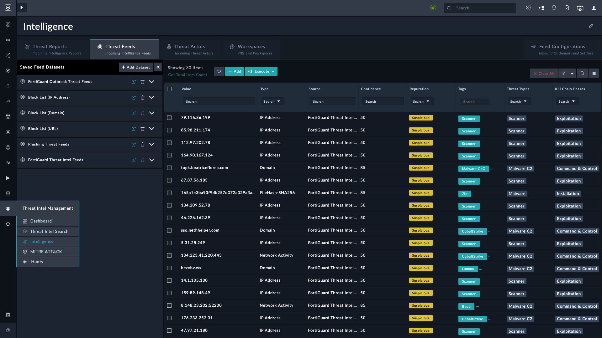

| [Home](../README.md) |
|----------------------|

# Feed Management

## Flow of Threat Intelligence Management

After installing TIM, configure feed connectors such as FortiGuard, Anomali Limo, Cisco Talos, MITRE ATT&CK, etc.

For connector setup, see [FortiSOAR Connectors](https://docs.fortinet.com/fortisoar/connectors).

### Dashboards

- ROI and ingestion effectiveness
- Observables linked to indicators
- Feed relevance

### Threat Intel Feed

Ingest feeds via Content Hub integrations and manage via **Threat Feeds** tab.

- Filter feeds by confidence, TLP, expiry, etc.
- Create **Datasets** to reduce noise and group feeds.
- From **FortiSOAR 7.2.2+**, enable **Trackable** to show Created/Modified metadata fields.

### Feed Configurations

- **Feed Sources**: install connectors from Content Hub.
- **TAXII Server**: broadcast datasets.
- **Threat Feed Rules**: see [Configuring Feed Rules](./setup.md#configuring-feed-rules).

### Importing Feeds from Files

1. Enable **Ingest Threat Feeds From Files** in **Feed Configurations**.
2. Go to **Threat Feeds** tab.
3. Click **Upload Unstructured Feeds**.
4. Supported formats: `csv`, `txt`, `pdf`, `eml`, `json`, `xlsx`.
5. Configure confidence, reputation, TLP, expiry, source, tags, and blocking behavior.

# Next Steps

| [Installation](./setup.md#installation) | [Configuration](./setup.md#configuration) | [Contents](./contents.md) |
|-----------------------------------------|-------------------------------------------|---------------------------|