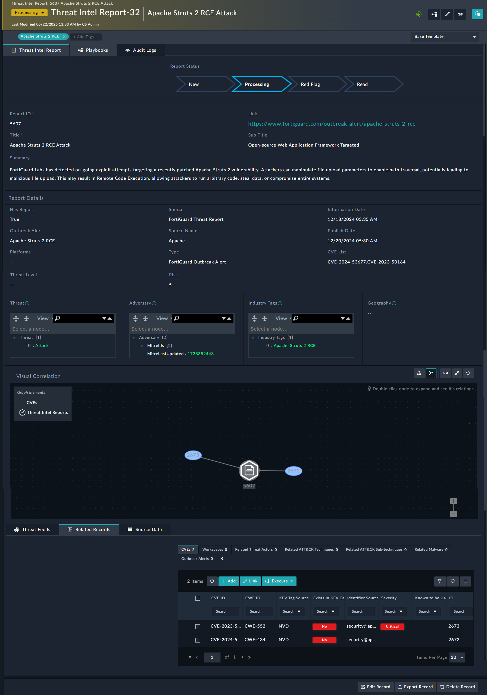

| [Home](../README.md) |
|----------------------|

# FortiGuard Integration

## Ingesting Reports

Supported report types: Outbreak Alerts, Signal Reports, FortiGuard Blogs, FortiGuard Events.

### Steps

1. Install TIM ([Installation](./setup.md#installation)).
2. Configure connectors (CISA, EPSS, NVD).
3. Trigger `Ingestion_fortinet-fortiguard-threat-intelligence_report` schedule (runs daily at 12:00 AM).
4. Access reports in **Threat Reports** tab.

### Report Details

- **Status**: New → Processing → Red Flag → Read.
- **Report Details**: source, type.
- JSON fields: Threat, Adversary, Tags, Geography.
- Visual correlations.
- Related CVEs.

# Next Steps

| [Installation](./setup.md#installation) | [Configuration](./setup.md#configuration) | [Contents](./contents.md) |
|-----------------------------------------|-------------------------------------------|---------------------------|