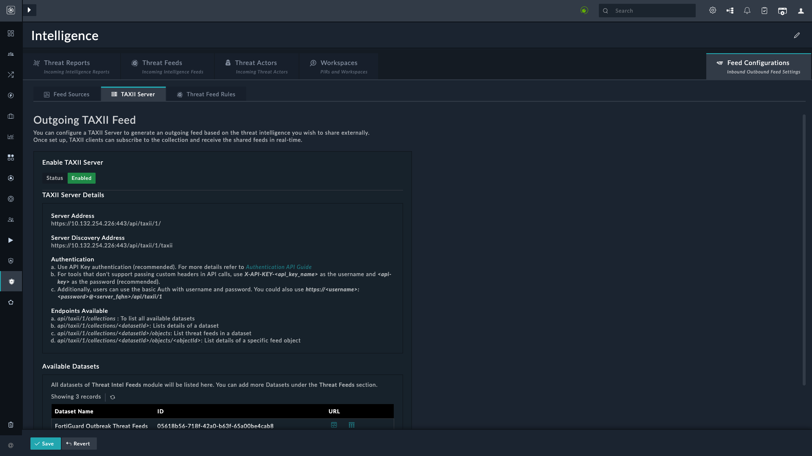

| [Home](../README.md) |
|----------------------|

## Setting up a TAXII Server

You can configure a TAXII Server to generate an outgoing feed based on the threat intelligence you wish to share externally.

Once set up, TAXII clients can subscribe to the collection and receive the shared feeds in real-time.

1. Enable the TAXII server from <picture><source media="(prefers-color-scheme: dark)" srcset="./res/icon-threat-intel-management-light.svg"><source media="(prefers-color-scheme: light)" srcset="./res/icon-threat-intel-management-dark.svg"></picture> **Threat Intelligence** <picture><source media="(prefers-color-scheme: dark)" srcset="./res/icon-chevron-light.svg"><source media="(prefers-color-scheme: light)" srcset="./res/icon-chevron-dark.svg"></picture> <picture><source media="(prefers-color-scheme: dark)" srcset="./res/icon-threat-intelligence-light.svg"><source media="(prefers-color-scheme: light)" srcset="./res/icon-threat-intelligence-dark.svg"></picture> **Hub**. 
2. Click **Feed Configurations** <picture><source media="(prefers-color-scheme: dark)" srcset="./res/icon-chevron-light.svg"><source media="(prefers-color-scheme: light)" srcset="./res/icon-chevron-dark.svg"></picture> **TAXII Server** tab.

### TAXII Server Details

The following details appear after you enable the TAXII server:

- **Server Address**:
  *`https://[server_address]/api/taxii/1/`*

- **Server Discovery Address**:
  *`https://[server_address]/api/taxii/1/taxii`*

- **Authentication**:
  Use one of the following methods to authenticate your API requests:

  1. **API Key Authentication (Recommended)**

      Refer to the section [Using API Key for TAXII Server Authentication](#using-api-key-for-taxii-server-authentication) for more information.

  2. **Custom Headers**
     If the tool does not support custom headers, use the following credentials:
     - Username: *`X-API-KEY-[api_key_name]`*
     - Password: *`[api-key]`*

  3. **Basic Authentication**
     Use the username and password combination or include the credentials directly in the server address:
     *`https://[username]:[password]@[server_address]/api/taxii/1/`*

For more information on authentication and data usage, refer to the [*Authentication API Guide*](https://docs.fortinet.com/document/fortisoar/7.6.1/api-guide/846127/overview#Authentication).

> [!NOTE]
> The basic authentication URL cannot be used directly in a browser. It must be used in a tool or script, such as Postman, that supports these authentication methods.

### Available Endpoints

The TAXII server provides the following endpoints to access datasets and feeds:

- **List all datasets**
  Endpoint: `/api/taxii/1/collections`

- **Get dataset details**
  Endpoint: `/api/taxii/1/collections/<datasetId>`

- **List threat feeds in a dataset**
  Endpoint: `/api/taxii/1/collections/<datasetId>/objects`

- **Get details of a specific feed object**
  Endpoint: `/api/taxii/1/collections/<datasetId>/objects/<objectId>`

> [!TIP]
> Refer to this [example](./example.md) that helps export CSV fields to FortiGate using Threat Intel Management's TAXII server.

## Using API Key for TAXII Server Authentication

This section uses Postman as a tool to view available endpoints of a TAXII server using API Key authentication.

In Postman, use the following settings to view a collection.

| Parameter | Value            |
|-----------|------------------|
| Method    | `GET`            |
| Auth Type | API Key          |
| Key       | Authorization    |
| Value     | *`your-api-key`* |
| Add to    | Header           |

For more information, refer to the section [Test a created API key](https://docs.fortinet.com/document/fortisoar/7.6.5/api-guide/797122/access-keys#Test_a_created_API_key) in FortiSOAR API documentation.

# Next Steps

| [Installation](./setup.md#installation) | [Configuration](./setup.md#configuration) | [Contents](./contents.md) |
|-----------------------------------------|-------------------------------------------|---------------------------|
