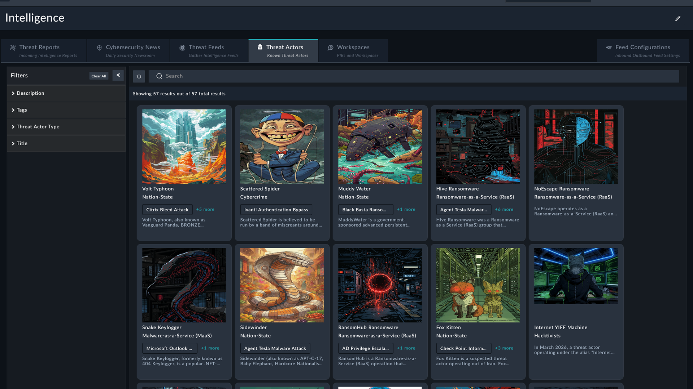

| [Home](../README.md)|
|---------------------|

# Threat Actor Intelligence

The **Threat Actor Intelligence** feature in Threat Intelligence Management (TIM) provides analysts with detailed insights into adversaries, their motivations, and their tactics, techniques, and procedures (TTPs).

## What is Threat Actor Intelligence

A *threat actor* is an individual, group, or organization responsible for conducting malicious cyber activities. FortiGuard provides continuously updated profiles of threat actors that include their capabilities, targeted sectors, geographical scope, and known campaigns.

By integrating this intelligence into TIM, SOC analysts gain enriched context that goes beyond indicators or feeds—linking observed activity to known adversaries and their historical behaviors.

## Using Threat Actor Data in TIM

- **Correlation with Threat Reports**: TIM automatically correlates FortiGuard threat actor data with existing feeds, reports, and ingested observables. Analysts can view connections between threat actors and ongoing campaigns, giving greater context to alerts.

- **Mapping to MITRE ATT&CK**: Threat actor profiles are correlated with MITRE ATT\&CK data, updating TIM fields such as *techniques*, *sub-techniques*, *groups*, and *tactics*. This mapping enables SOC analysts to quickly identify likely attack patterns and understand potential adversary objectives.

- **Mapping to CVEs**: The threat actor record also correlates with CVEs associated with the threat actors.

- **Seamless Integration**: The threat actor module is already bundled in TIM. Retrieved information is automatically mapped to existing TIM fields, including:

    - **Actor profile**: Name, aliases, first seen/last seen.
    - **Target sectors and regions**
    - **Associated malware and tools**
    - **Observed techniques and sub-techniques (MITRE mapping)**
    - **Related indicators and campaigns**

## Launching Threat Actor Intelligence

To access threat actor intelligence in TIM:

1. In the left navigation pane, go to <picture><source media="(prefers-color-scheme: dark)" srcset="./res/icon-threat-intel-management-light.svg"><source media="(prefers-color-scheme: light)" srcset="./res/icon-threat-intel-management-dark.svg"></picture> **Threat Intelligence** <picture><source media="(prefers-color-scheme: dark)" srcset="./res/icon-chevron-light.svg"><source media="(prefers-color-scheme: light)" srcset="./res/icon-chevron-dark.svg"></picture> <picture><source media="(prefers-color-scheme: dark)" srcset="./res/icon-threat-intelligence-light.svg"><source media="(prefers-color-scheme: light)" srcset="./res/icon-threat-intelligence-dark.svg"></picture> **Hub**.

2. Select the tab **Threat Actor**. Cards containing threat actor information are displayed.

    

    - The checkboxes on the left act as filters to manage the Threat Actors' list.
        - Click any of the types listed in **Threat Actor Type** to filter the list of bad actors.

            For example, selecting *`Malware-as-a-Service (MaaS)`* under *Threat Actor Type*, lists `Rhadamanthys` and `Redline Stealer`.

        - Click any of the **Targeted Industries**  to filter the threat actors' list.

            For example, selecting *`Apparel`* under *Targeted Industries*, lists `Scattered Spider`.

        - Specify tags, separated by a comma, under **Search By Tags** list threat actors associated with the specified tag.

            For example, typing *`Agent Tesla Malware Attack`* under *Search By Tags*, lists `APT36`, `OilRig`, `Lazarus`, and `Kimsuky`.

3. Select a card to drill down into a detailed view of the threat actor, including links to related reports, indicators, and campaigns.

    Each card summarizes the actor profile with details such as targeted industries, aliases, known tools used, known infection vectors, and mapped MITRE techniques.

# Next Steps

| [Installation](./setup.md#installation) | [Configuration](./setup.md#configuration) | [Contents](./contents.md) |
|:--:|:--:|:--:|

