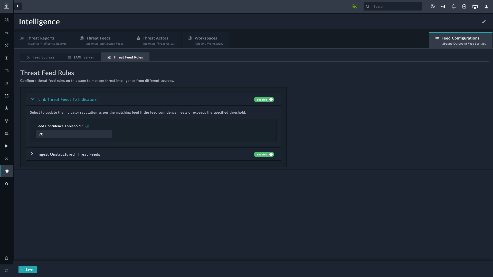
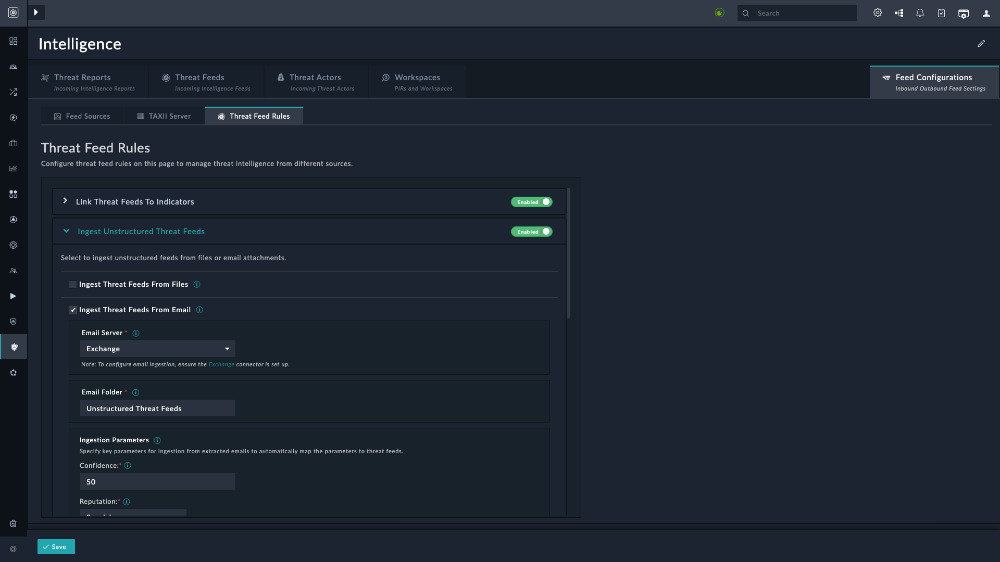

| [Home](../README.md) |
|----------------------|

## Overview

We introduced **Threat Feed Rules** to manage ingested threat feeds. Ingesting threat feeds, which contain data about potential threats, is essential for any threat intelligence platform. However, ingestion alone does not produce actionable insights. Without proper processing and analysis, this data can be overwhelming and difficult to use effectively.

**Threat Feed Rules** address this challenge by providing a structured approach to managing these feeds. These rules help you define specific criteria and conditions for how threat data should be processed. For example, you can set rules to filter, categorize, or prioritize threats based on predefined patterns or attributes.

This framework also enhances automation in threat analysis. Once the rules are set, the system automatically processes incoming feeds and applies these rules to generate insights or trigger responses. **Threat Feed Rules** improve the functionality of the **Threat Intelligence Management** solution pack by streamlining analysis and response. The rules ensure the platform is more than a repository; It is a tool to detect, analyze, and respond to threats with greater accuracy and speed.

## Linking Threat Feed to Indicator

The **Link Threat Feed to Indicators** rule helps automate the process of associating threat feed data with the corresponding Indicators of Compromise (IOCs) in your system. Based on the feed’s confidence level, this rule updates the reputation of matching indicators when the **Feed Confidence Threshold** is met.

The following steps show how this rule works:

1. **Ingesting IOCs**
    1. Threat feeds from external sources (such as commercial or open-source threat intelligence providers) are ingested into the system.
        - Each feed comes with:
            - **IOCs**: IOCs comprising IP addresses, domains, URLs, etc.
            - **Confidence score**: Defines a feed's reliability.
            - **Reputation score**: Categorizes the feed’s threat level, such as `High`, `Medium`, or `Low`.
    2. Alerts are ingested from sources such as SIEM or EDR systems, and indicator records are created from them.

2. **Matching Indicator records to Threat Feeds**: The system matches indicator records with indicators in threat feeds.

3. **Checking Feed Confidence Threshold**: The rule compares the feed’s confidence score with the configured **Feed Confidence Threshold** (for example, `70`).

4. **Updating Reputation**: If the feed’s confidence meets or exceeds the threshold, the indicator's reputation is updated to match the feed’s reputation.

## Ingesting Unstructured Threat Feeds

The **Ingest Unstructured Threat Feeds** rule helps automate the ingestion and processing of unstructured threat data from files and email attachments. Unstructured threat data is raw information without a predefined format, making it difficult to parse and analyze manually.

By implementing this rule, the system can automatically parse and analyze the unstructured data, extracting valuable threat intelligence from these sources.The system creates structured threat feeds that improve detection and provide a broader view of the threat landscape.

After enabling this rule, see [Importing Feeds from Files](./usage.md#importing-feeds-from-files) for instructions.

### Ingesting Threat Feeds from Email Attachments

Select **Ingest Threat Feeds From Email** to automatically ingest unstructured threat data from *unread* email attachments.

> [!NOTE]
> Configure the Exchange connector to ingest email attachments. See [Exchange](https://docs.fortinet.com/fortisoar/connectors/exchange) connector documentation for details.

> [!TIP]
> Create an email rule to move all incoming threat feed attachments to a separate folder, and ensure they remain **Unread**.

1. Select a mail server. Currently, only **Exchange** is supported.
2. Specify the folder that stores emails with threat feed attachments.
3. Specify the **Ingestion Parameters**:
    - **Confidence**: The confidence score to assign to the ingested unstructured threat feeds.
    - **Reputation**: The reputation to assign to the ingested unstructured threat feeds.
    - **TLP**: The TLP to assign to the ingested unstructured threat feeds.
    - **Maximum Age (in days)**: The age of the ingested unstructured threat feeds, in days.
    - **Source**: A value to be updated as *Source* for all ingested unstructured threat feeds.
    - **Tags**: Comma-separated values to be assigned as tags to the ingested unstructured threat feeds.

4. Specify **Email Ingestion Schedule**:
    1. Select the frequency at which unstructured threat feeds are ingested from emails. For example, if you want to ingest emails every 5 minutes, click **Every X Minute**, and in the **minute** box enter `*/5`. This means that emails are ingested every 5 minutes.
    2. **Timezone**: Select the timezone in which to export the report. Default is *`UTC`*.

5. **Block Threat Feeds Automatically**: Select this option to block threat feeds immediately on ingestion.

6. Click **Save**.

# Next Steps

| [Usage](./usage.md) | [Contents](./contents.md) |
|---------------------|---------------------------|