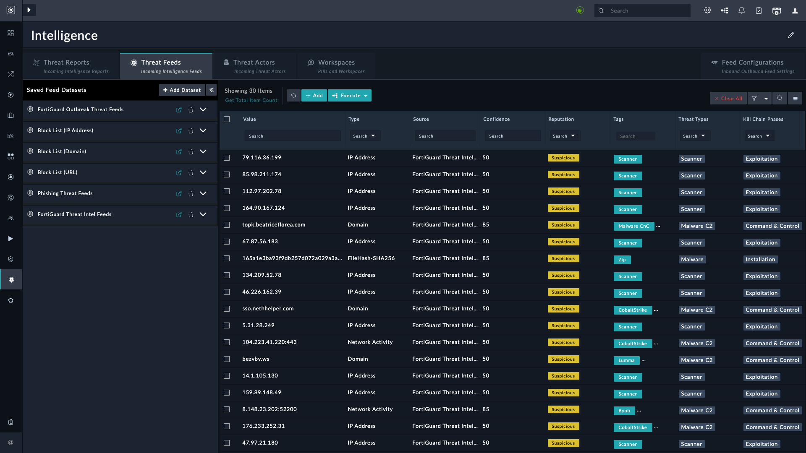
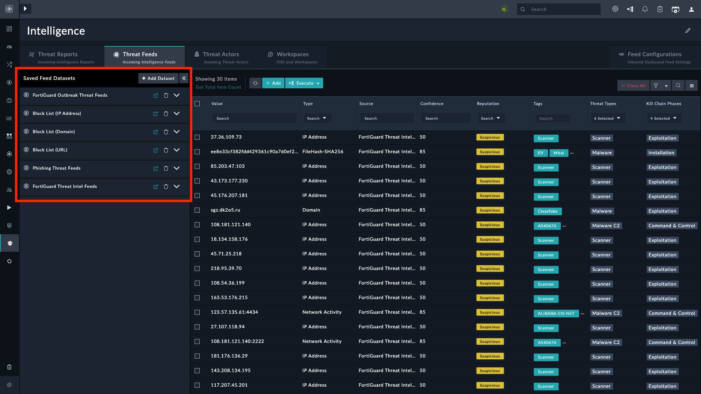
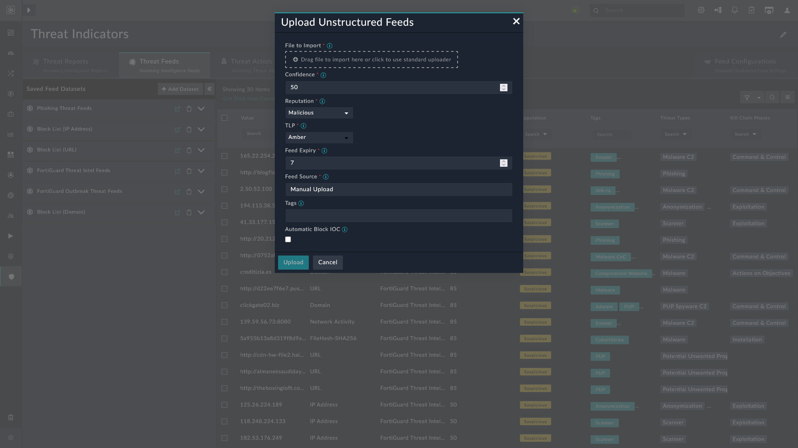
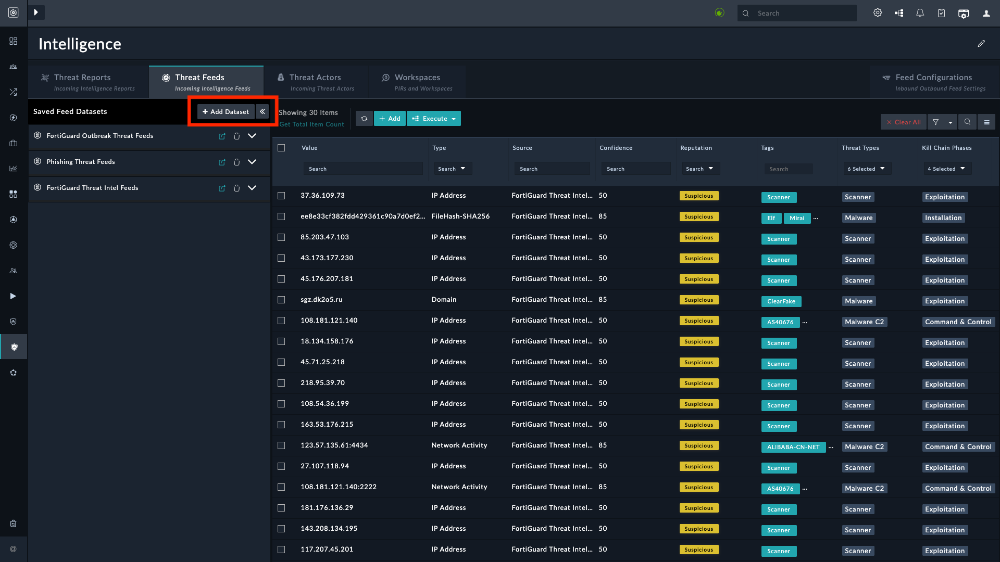

| [Home](../README.md) |
|----------------------|

# Threat Feeds

Using a wide variety of feed integrations that are available on the [Content Hub](https://fortisoar.contenthub.fortinet.com//list.html?contentType=all), you can seamlessly ingest feeds and get a normalized and aggregated view of the feeds on the Threat Feeds tab of **Threat Intel Management** <picture><source media="(prefers-color-scheme: dark)" srcset="./res/icon-chevron-light.svg"><source media="(prefers-color-scheme: light)" srcset="./res/icon-chevron-dark.svg"></picture> **Threat Intel Feeds**:

*Threat Intel Management* allows you to create **Datasets**. The **Manage Datasets** arrow <picture><source media="(prefers-color-scheme: dark)" srcset="./res/icon-collapse-light.svg"><source media="(prefers-color-scheme: light)" srcset="./res/icon-collapse-dark.svg"></picture> can be used to hide, and bring into view, the datasets created out-of-the-box, or to add new datasets:

The time of the creation of feeds at intel source appears under the field **Created at Source**. Similarly, **Modified at Source** shows the time of modification at the intel source.

## Feed Configurations

The **Feed Configurations** tab contains settings for easy feed management and dissemination. It has the following tabs:

- **Feed Sources**: Directs you to a Content Hub page that lists and helps install connectors that can fetch threat intel feeds.

- **TAXII Server**: broadcast datasets. 

- **Threat Feed Rules**: Helps manage incoming threat feeds through rules. For more information, refer to the [Configuring Feed Rules](./setup.md#configuring-feed-rules).

### Importing Feeds from Files

1. Enable the option **Ingest Threat Feeds From Files** under **Feed Configurations** <picture><source media="(prefers-color-scheme: dark)" srcset="./res/icon-chevron-light.svg"><source media="(prefers-color-scheme: light)" srcset="./res/icon-chevron-dark.svg"></picture> **Ingest Unstructured Threat Feeds** and click **Save**.
2. Navigate to **Threat Intel Management** > **Threat Feeds** Tab.
3. Click the button **Upload Unstructured Feeds**.

    

4. Under **File to Import**, click the box to browse and upload the file. Supported file formats are `csv`, `txt`, `pdf`, `eml`, `json`, and `xlsx`.
5. **Confidence**: Specify the confidence score to assign to the ingested unstructured threat feeds.
6. **Reputation**: Select the reputation to assign to the ingested unstructured threat feeds.
7. **TLP**: Select the TLP to assign to the ingested unstructured threat feeds.
8. **Feed Expiry**: Specify the number of days after which the ingested unstructured threat feeds are marked as expired for deletion.
9. **Feed Source**: Specify a value to be updated as Source for all ingested unstructured threat feeds.
10. **Tags**: Specify comma-separated values to be assigned as tags to the ingested unstructured threat feeds.
11. Select the option **Automatic Block IOC** to block threat feeds immediately on ingestion. Leave unchecked to manually block threat feeds later.

## Adding a Dataset

You can create a different dataset from the feeds to filter unwanted noise:

1. Navigate to **Threat Intel Management** <picture><source media="(prefers-color-scheme: dark)" srcset="./res/icon-chevron-light.svg"><source media="(prefers-color-scheme: light)" srcset="./res/icon-chevron-dark.svg"></picture> **Threat Intel Feeds**.

    

2. Click the button <picture><source media="(prefers-color-scheme: dark)" srcset="./res/icon-add-light.svg"><source media="(prefers-color-scheme: light)" srcset="./res/icon-add-dark.svg"></picture> Add Dataset, under the tab **Threat Feeds**.
3. Enter the **Dataset Label** and **Filter Criteria** to filter the targeted dataset.
4. Click **Save Dataset**.

# Next Steps

| [Installation](./setup.md#installation) | [Configuration](./setup.md#configuration) | [Contents](./contents.md) |
|-----------------------------------------|-------------------------------------------|---------------------------|
