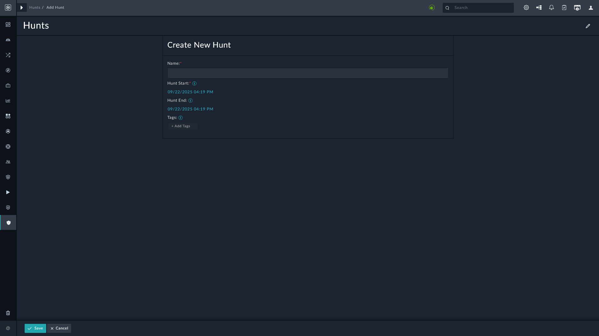

| [Home](../README.md) |
|----------------------|

# Threat Hunt

The Threat Hunt module is a place to store and organize your hunts and you can find it under **Threat Intel Management** <picture><source media="(prefers-color-scheme: dark)" srcset="./res/icon-chevron-light.svg"><source media="(prefers-color-scheme: light)" srcset="./res/icon-chevron-dark.svg"></picture> **Hunts**.

Hunts you create here acts as a central repository to associate *Alerts*, *Assets*, *Users*, and other module records with your hunting activity.

1. Click <picture><source media="(prefers-color-scheme: dark)" srcset="./res/icon-add-light.svg"><source media="(prefers-color-scheme: light)" srcset="./res/icon-add-dark.svg"></picture> **Add**.

    

2. Specify a name of the hunt in the **Name** field.

3. Specify a start date and time for the hunt in the **Hunt Start** field.

4. Specify an end date and time for the hunt in the the **Hunt End** field.

5. Specify tags associated with the hunt in the **Tags** field. The tags can be selected from the suggested options, or separated by a comma (`,`) or the `tab` key.

6. Click **Save**.

The **Hunt Start** time is a *required* parameter, while the the **Hunt End** time is optional. Hunt Start and Hunt End times can be modified any time in order to expand or contract the hunting window.

> [!TIP]
> We recommend that you pick a constrained start time during the initial stages of a hunt, to gauge the number of returned results and tune any obvious false positives before running a larger-scale hunt.

One the hunt is created, open the Hunt record to add any alerts or indicators that you've identified during your hunt.

# Next Steps

| [Installation](./setup.md#installation) | [Configuration](./setup.md#configuration) | [Contents](./contents.md) |
|-----------------------------------------|-------------------------------------------|---------------------------|
