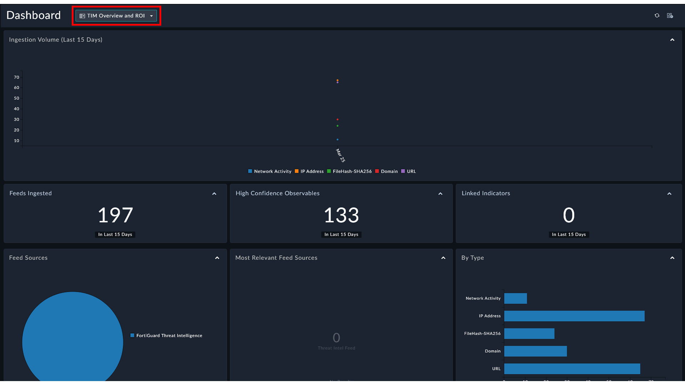
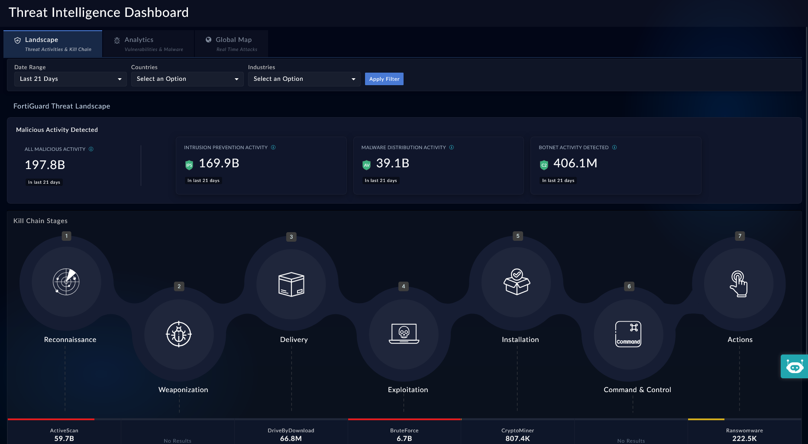
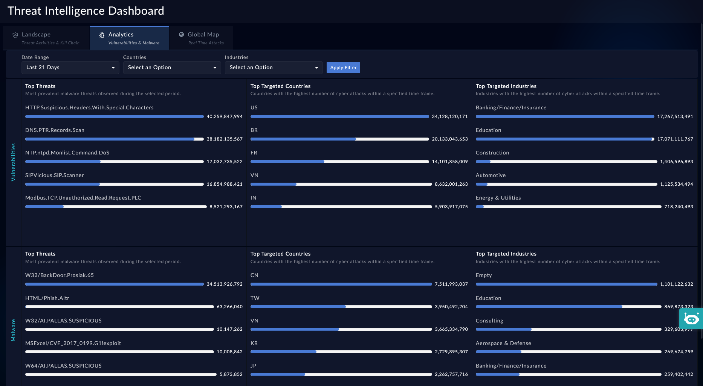
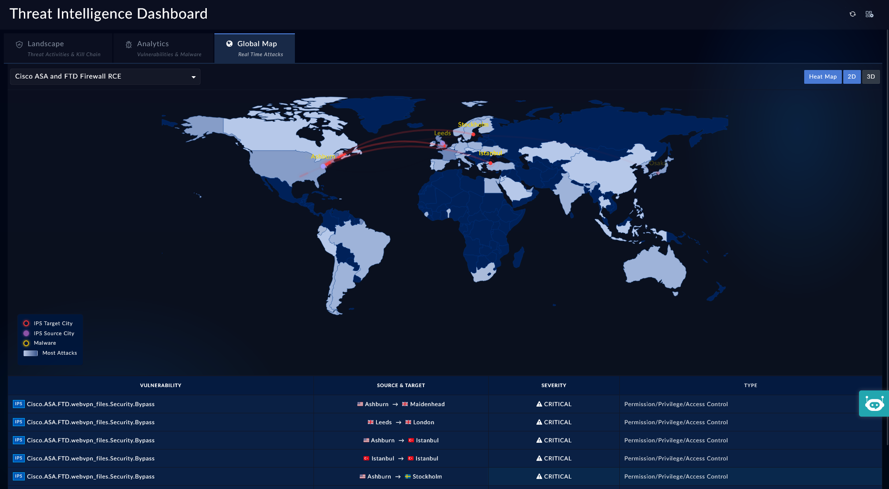

| [Home](../README.md) |
|----------------------|

# TIM Overview and ROI Dashboard

The **TIM Overview and ROI** dashboard summarizes threat intelligence ingestion and activity over time. It shows trends in indicators collected from threat feeds, highlights high-confidence observables, and tracks how many indicators are linked to investigations.

The dashboard also visualizes feed sources, the distribution of observable types (such as IPs, domains, and URLs), and intelligence activity like PIR requests and active workspaces. Together, these widgets help analysts quickly understand the volume, sources, and operational relevance of ingested threat intelligence.

1. Navigate to **Dashboard** <picture><source media="(prefers-color-scheme: dark)" srcset="./res/icon-dashboard-light.svg"><source media="(prefers-color-scheme: light)" srcset="./res/icon-dashboard-dark.svg"></picture>.

2. Select the **TIM Overview and ROI** dashboard from the drop-down.

    

# Threat Intelligence Dashboards

The **Threat Intelligence** dashboards provide a visual summary of threat intelligence collected from multiple feeds. These dashboards help analysts quickly understand ingestion trends, global threat activity, prevalent malware and vulnerabilities, and active attack patterns.

Views such as **Landscape**, **Analytics**, and **Global Map** present intelligence through charts, statistics, and geographic visualizations, enabling analysts to monitor threat trends and investigate emerging threats more efficiently.

## Landscape Dashboard

The **Landscape** dashboard presents a global view of threat activity derived from FortiGuard Labs. It summarizes large-scale malicious activity &ndash; such as intrusion attempts, malware distribution, and botnet operations. Analysts can filter the data by time period, country, or industry to focus on relevant threat activity.

The dashboard also visualizes attacker behavior across the cyber kill chain, highlighting activity across stages such as reconnaissance, exploitation, and command-and-control.

Hovering over a stage emphasizes the associated threat metrics, helping analysts quickly understand where attacks are most active in the lifecycle.

1. Navigate to <picture><source media="(prefers-color-scheme: dark)" srcset="./res/icon-tim-light.svg"><source media="(prefers-color-scheme: light)" srcset="./res/icon-tim-dark.svg"></picture> **Threat Intel Management** <picture><source media="(prefers-color-scheme: dark)" srcset="./res/icon-chevron-light.svg"><source media="(prefers-color-scheme: light)" srcset="./res/icon-chevron-dark.svg"></picture> <picture><source media="(prefers-color-scheme: dark)" srcset="./res/icon-dashboard-light.svg"><source media="(prefers-color-scheme: light)" srcset="./res/icon-dashboard-dark.svg"></picture> **Overview**.

2. Select the **Landscape** tab.

    

### Available Filters

The following filters are available at the top of the dashboard:
| Filter     | Description                                        |
|:-----------|:---------------------------------------------------|
| Date Range | Filters the threat data based on selected duration |
| Countries  | Filters data specific to selected countries        |
| Industries | Filters data specific to selected industries       |

### Filter Behavior

The dashboard data is dynamically populated based on the selected filters.

- Selecting a specific country displays threat intelligence relevant to that geography. 

- Selecting an industry displays attacks targeting that industry sector.

- Date range controls the threat activity duration window.

### FortiGuard Threat Landscape

This section displays high-level threat intelligence statistics.

- **All Malicious Activity**

    This section displays the total malicious activities detected during the selected time period and provides a high-level overview of overall threat activity volume.

- **Intrusion Prevention Activity**

    Displays IPS-related detections and intrusion prevention events and tracks exploit attempts and network intrusion activities.

- **Malware Distribution Activity**

    Displays malware propagation and malware-related detections and provides visibility into malware campaigns and infection trends.

- **Botnet Activity Detected**

    Displays botnet-related communications and infected endpoint activity and helps identify command-and-control communications and compromised hosts.

### Kill Chain Stages

| Stage             | Description                           |
|-------------------|---------------------------------------|
| Reconnaissance    | Attacker gathering target information |
| Weaponization     | Preparation of malicious payloads     |
| Delivery          | Delivery of malware or exploit        |
| Exploitation      | Exploiting vulnerabilities            |
| Installation      | Malware installation on target        |
| Command & Control | Remote attacker communication         |
| Actions           | Final attacker objectives/actions     |

The lower section visualizes threats mapped against Cyber Kill Chain stages.

## Analytics Dashboard

The **Analytics** dashboard provides insight into global threat trends based on intelligence from FortiGuard Labs. Analysts can filter the data by time period, country, or industry to focus on relevant threat activity.

The dashboard highlights the most prevalent vulnerabilities and malware observed during the selected period, along with the countries and industries most frequently targeted. These insights help analysts understand where attacks are concentrated and which threats are most active.

1. Navigate to <picture><source media="(prefers-color-scheme: dark)" srcset="./res/icon-tim-light.svg"><source media="(prefers-color-scheme: light)" srcset="./res/icon-tim-dark.svg"></picture> **Threat Intel Management** <picture><source media="(prefers-color-scheme: dark)" srcset="./res/icon-chevron-light.svg"><source media="(prefers-color-scheme: light)" srcset="./res/icon-chevron-dark.svg"></picture> <picture><source media="(prefers-color-scheme: dark)" srcset="./res/icon-dashboard-light.svg"><source media="(prefers-color-scheme: light)" srcset="./res/icon-dashboard-dark.svg"></picture> **Overview**.

2. Select the **Analytics** tab.

    

### Available Filters

The following filters are available at the top of the dashboard:

| Filter     | Description                                       |
|------------|---------------------------------------------------|
| Date Range | Filters analytics data based on selected duration |
| Countries  | Filters data specific to selected countries       |
| Industries | Filters data specific to selected industries      |

The **Analytics** is like a grid with rows labeled *Vulnerabilities* and *Malware* and *Top Threats*, *Top Targeted Countries*, and *Top Targeted Industries* as columns.

### Vulnerabilities Section

This section displays vulnerability attack trends and targeted entities.

#### Top Threats

Displays the most prevalent vulnerability-based threats observed during the selected period and helps identify the following:

- Most active vulnerability scans
- Exploitation attempts
- Network probing activities
- Common attack vectors

#### Top Targeted Countries

Displays countries with the highest number of cyber attacks and provides geographical visibility into attack targeting trends.

#### Top Targeted Industries

Displays industries most frequently targeted by cyber attacks and helps identify high-risk industry sectors.

### Malware Section

This section displays malware-related threat analytics.

#### Top Threats

Displays the most prevalent malware threats observed during the selected period and provides visibility into:

- Active malware campaigns
- Phishing malware
- Suspicious malware families
- Endpoint infection trends

#### Top Targeted Countries

Displays countries most impacted by malware threats and shows malware targeting distribution across regions.

#### Top Targeted Industries

Displays industries most impacted by malware threats and helps analysts identify industries heavily targeted by malware campaigns.

## Global Map Dashboard

The **Global Map** dashboard provides a geographic perspective of ongoing attacks, helping analysts quickly identify global hot-spots, attack paths, and emerging threat patterns.

Analysts can also enable **Heat Map** to highlight countries with most attacks, and view the threat map in both 3D (Globe) and 2D (Mercator projection).

1. Navigate to <picture><source media="(prefers-color-scheme: dark)" srcset="./res/icon-tim-light.svg"><source media="(prefers-color-scheme: light)" srcset="./res/icon-tim-dark.svg"></picture> **Threat Intel Management** <picture><source media="(prefers-color-scheme: dark)" srcset="./res/icon-chevron-light.svg"><source media="(prefers-color-scheme: light)" srcset="./res/icon-chevron-dark.svg"></picture> <picture><source media="(prefers-color-scheme: dark)" srcset="./res/icon-dashboard-light.svg"><source media="(prefers-color-scheme: light)" srcset="./res/icon-dashboard-dark.svg"></picture> **Overview**.

2. Select the **Global Map** tab.

    

### Available Controls

| Control                 | Description                                        |
|-------------------------|----------------------------------------------------|
| Outbreak Alert Selector | Selects a specific outbreak/vulnerability campaign |
| Heat Map                | Displays attack intensity visualization            |
| 2D                      | Displays the map in 2D view                        |
| 3D                      | Displays the map in 3D view                        |

### Outbreak Alert Selection

The dashboard data dynamically changes based on the selected outbreak alert.

Consider for example: *Cisco ASA and FTD Firewall RCE* outbreak. Changing the outbreak selection updates the following:

- Attack paths 
- Source locations 
- Target locations 
- Severity details 
- Attack records 
- Real-time event data 

### Map Visualization

The Global Map displays the following:

- Attack source cities
- Attack target cities
- Malware activity indicators
- Attack flow lines between regions

### Map Indicators

| Indicator       | Description                   |
|-----------------|-------------------------------|
| IPS Target City | Destination city under attack |
| IPS Source City | Origin/source of attack       |
| Malware         | Malware outbreak indicators   |

### Attack Flow Visualization

The dashboard visually represents:

- Attack direction
- Source-to-target communication
- Cross-country attack propagation
- Real-time cyber attack activity

The following are some example attack paths that you might notice:

- Europe → Middle East
- Asia → Europe
- North America → Asia

### Real-Time Attack Table

| Column        | Description                           |
|---------------|---------------------------------------|
| Vulnerability | Name of the vulnerability or outbreak |
| Source        | Source country/location of attack     |
| Target        | Target country/location of attack     |
| Severity      | Severity level of the attack          |
| Type          | Attack or malware category            |

The lower section of the dashboard displays real-time attack information in tabular format.

# Next Steps

| [Installation](./setup.md#installation) | [Configuration](./setup.md#configuration) | [Contents](./contents.md) |
|-----------------------------------------|-------------------------------------------|---------------------------|
