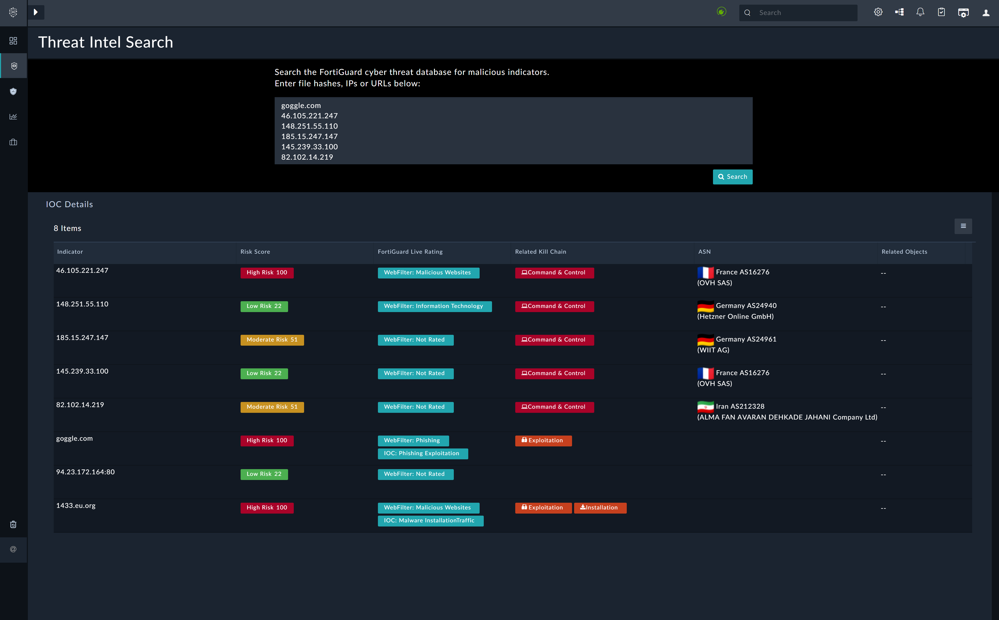
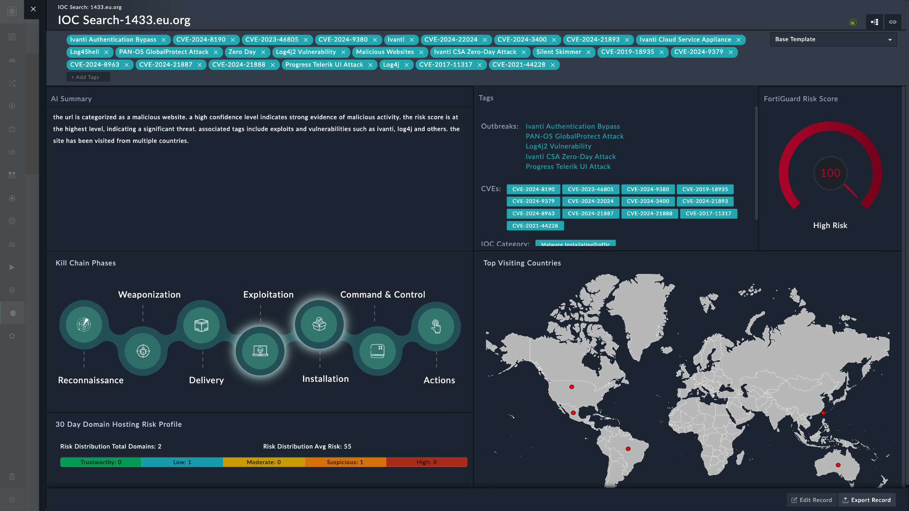

| [Home](../usage.md) |
|---------------------|

# Threat Intel Search

The **Threat Intel Search** feature allows SOC analysts to query FortiGuard Labs' global threat intelligence for detailed insights into suspicious domains, IP addresses, and other indicators of compromise (IOCs). This feature is deeply integrated into Threat Intel Management (TIM) and complements existing enrichment and correlation workflows.

## Performing a Search

On the **Threat Intel Search** page:

- Enter up to **10 indicators** separated by line breaks.

- Click the <picture><source media="(prefers-color-scheme: dark)" srcset="./res/icon-ioc-search-light.svg"><source media="(prefers-color-scheme: light)" srcset="./res/icon-ioc-search-dark.svg"></picture> **Search** button to begin.

    Example input:

    ```
    goggle.com
    46.105.221.247
    148.251.55.110
    185.15.247.147
    145.239.33.100
    82.102.14.219
    94.23.172.164:80
    1433.eu.org
    ```

The results page lists all IOCs found:



Click any record to view detailed information.

## Results Dashboard

The IOC details dashboard provides a threat intelligence snapshot enriched with risk context, vulnerabilities, and attack mapping.



### AI Summary
- Automated analysis of the IOC's risk.
- Example (`1433.eu.org`):
  - **Risk Score**: 100 (High Risk)
  - **Confidence Level**: High
  - **Threat Indicators**: Malicious activity, exploitation attempts, threat tags
  - **Reputation Insight**: Accessed across multiple geographies

### Indicator Overview
- IOC details including category, live threat score, and web filter classification.
- Example (`1433.eu.org`):
  - **Category**: Malware Installation/Traffic
  - **Web Filter**: Malicious Websites
  - **Live Threat Score**: 100 (high risk, shown via dial gauge)

### Tags
- Associated CVEs
- Named threats and exploits (e.g., Log4J, Silent Skimmer)
- Outbreaks and exploitation techniques

### Top Visiting Countries
- Global map with geolocation of visitors.
- Red dots indicate high traffic from regions (e.g., East Asia, Australia, South America).

### Outbreaks
Lists active threat campaigns linked to the IOC.
Example (`1433.eu.org`):
- Ivanti Authentication Bypass
- PAN-OS GlobalProtect Attack
- Log4J Vulnerability
- Progress Telerik UI Attack

### CVEs
- Horizontal scroll view of related vulnerabilities.
- Example:
  - `CVE-2024-8190`
  - `CVE-2023-46805`
  - `CVE-2017-11317`

### Kill Chain Phases
- Maps IOC activity to Lockheed Martin's kill chain stages:
  `Reconnaissance → Weaponization → Delivery → Exploitation → Installation → Command & Control → Actions`
- Current IOC phase is highlighted.

> [!Note]
> Phase highlighting is not displayed in Mozilla Firefox.

### 30-Day Hosting Risk Profile
- Displays hosting risk and reputation over the past 30 days.
- Example (`1433.eu.org`):
  - **Total Domains**: 2
  - **Average Risk Score**: 55
  - **Trust Levels**: High Risk (1), Suspicious (1)

# Next Steps

| [Installation](./setup.md#installation) | [Configuration](./setup.md#configuration) | [Contents](./contents.md) |
|-----------------------------------------|-------------------------------------------|---------------------------|
