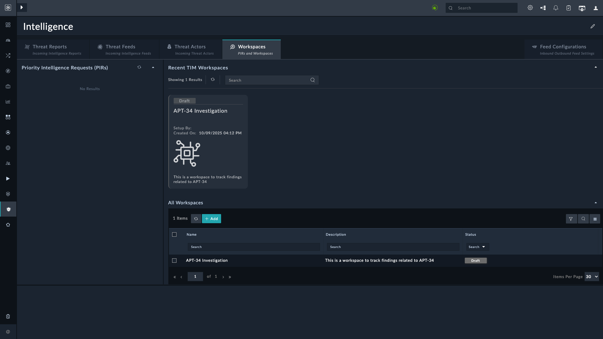
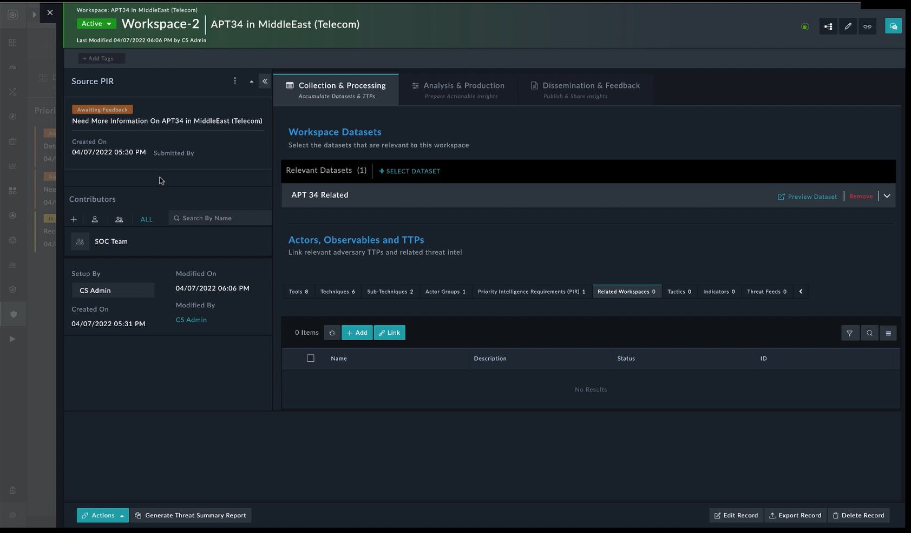
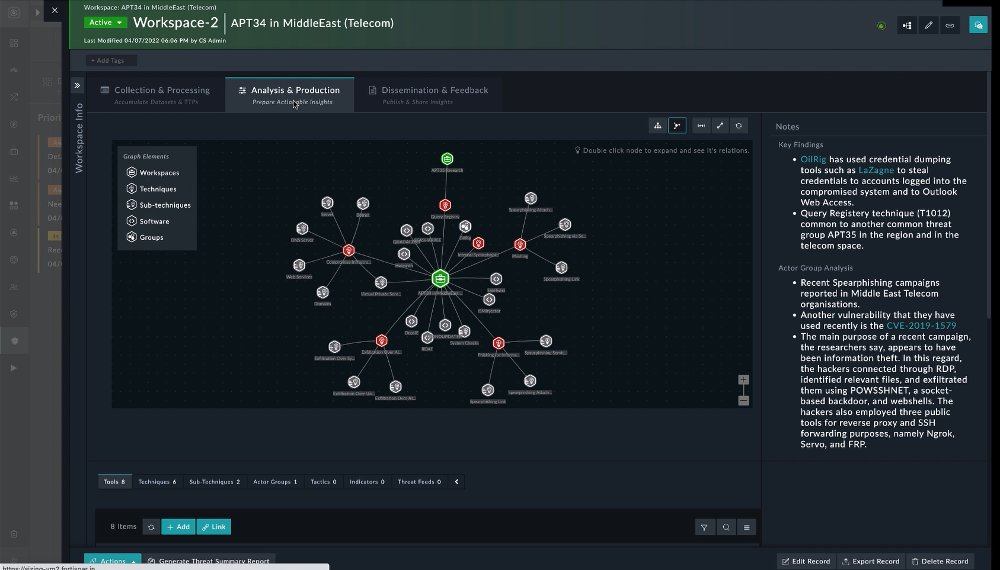
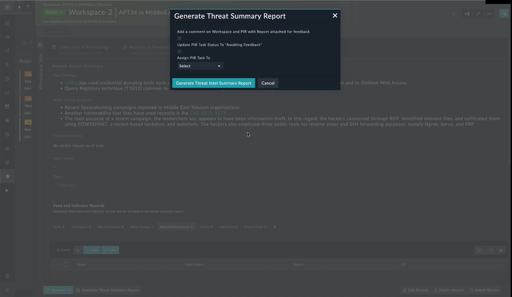
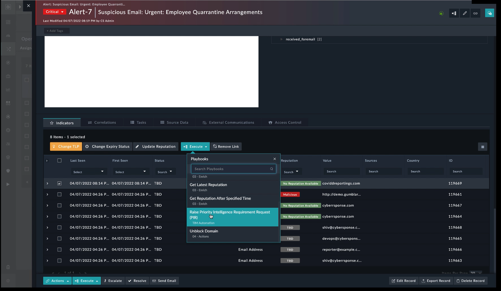

| [Home](../README.md) |
|----------------------|

# Threat Intelligence Workflow

1. In the left navigation pane, go to <picture><source media="(prefers-color-scheme: dark)" srcset="./res/icon-threat-intel-management-light.svg"><source media="(prefers-color-scheme: light)" srcset="./res/icon-threat-intel-management-dark.svg"></picture> **Threat Intelligence** <picture><source media="(prefers-color-scheme: dark)" srcset="./res/icon-chevron-light.svg"><source media="(prefers-color-scheme: light)" srcset="./res/icon-chevron-dark.svg"></picture> <picture><source media="(prefers-color-scheme: dark)" srcset="./res/icon-threat-intelligence-light.svg"><source media="(prefers-color-scheme: light)" srcset="./res/icon-threat-intelligence-dark.svg"></picture> **Hub**.

2. Select the tab **Workspaces**.

## Workspaces

- Create workspaces based on PIRs.
- Stages: Collection & Processing, Analysis & Production, Dissemination & Feedback.
- Use datasets, MITRE ATT&CK data, indicators.

## Analysis & Notes

- Correlation views.
- Notes and findings.
- Task assignment.

## Dissemination & Reports

- Generate Threat Summary Reports.
- Attach to PIRs, request feedback, close loop.

## Example Scenario

Phishing alert with COVID correlation:

1. Raise PIR request.
2. TIM team creates workspace.
3. Investigates URL, IPs, Whois, etc.
4. Shares intel with Firewall team.

# Next Steps

| [Installation](./setup.md#installation) | [Configuration](./setup.md#configuration) | [Contents](./contents.md) |
|-----------------------------------------|-------------------------------------------|---------------------------|
