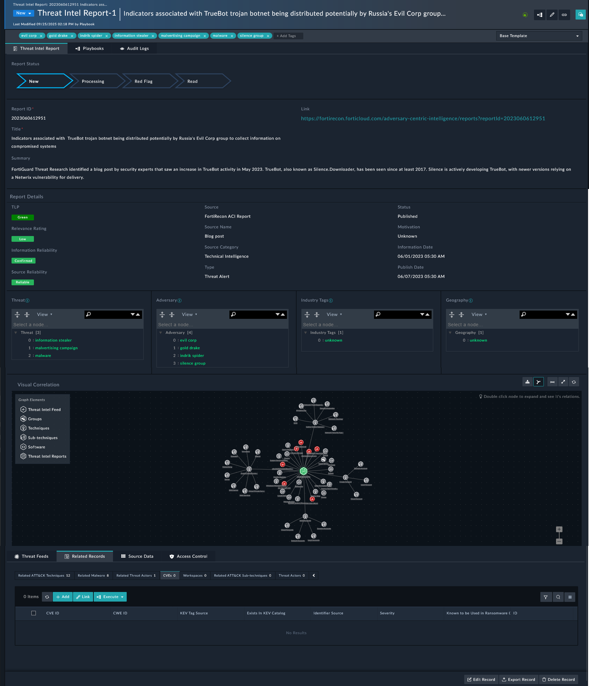

| [Home](../README.md) |
|----------------------|

# Ingesting Reports

A **threat intelligence report** provides critical insights into emerging or ongoing cyber threats, helping organizations understand the risks they face and how to defend against them.

With its comprehensive integration with Fortinet FortiGuard, Fortinet's flagship threat intelligence source, as part of the FortiSOAR's TIM Solution, you get multiple lookups! into the rich FortiGuard threat intelligence database and the ability to ingest its valuable daily threat intelligence feed.

Key elements of the report include:

1. **Executive Summary**: A concise overview of the threat, its impact, and actionable insights.
2. **Threat Context**: Detailed information on the attack techniques, tactics, and procedures (TTPs) used by adversaries.
3. **Indicators of Compromise (IOCs)**: Specific data points (e.g., IP addresses, file hashes) tied to the malicious activity.
4. **Adversary Attribution**: Identification of the threat actor behind the attack, including their motivations.
5. **Impact Assessment**: Analysis of potential damage, such as financial loss or data breaches.
6. **Defensive Recommendations**: Advice on how to mitigate the threat and strengthen security.
7. **Visual Correlation**: Diagrams and graphs linking IOCs and attack techniques.
8. **Historical Context**: Information on how the current threat compares to past incidents.

These reports are essential for helping organizations detect, assess, and respond to cyber threats proactively.

## FortiGuard Threat Reports Ingestion

The FortiGuard Labs Threat Signal delivers curated, concise, and actionable insights into emerging cyber threats, combining clear technical details, expert analysis, and mitigation recommendations in an intuitive FAQ-style format.

- Ingest Threat Reports from FortiGuard.

- FortiGuard Reports Types - Outbreak Alerts, Signal Reports, FortiGuard Blogs, FortiGuard Events.

- Daily ingestion schedule is available for automated ingestion. You can manually ingest FortiGuard threat reports by clicking **Fetch Latest Threat Report**.

    

## FortiRecon ACI Report Ingestion Simulation

To understand the process FortiSOAR follows to ingest threat reports from various threat intel providers, we have included a scenario &mdash; **Threat Intel Report** with this solution pack. The example threat report from **FortiRecon ACI** contains the following information:

- Report Title, Summary, Status, other report details
- Indicators that were extracted and correlated with threat feeds.
- Adversaries linked with MITRE ATT&CK groups, techniques, sub-techniques.

> [!NOTE]
> Refer to [Simulate Scenario documentation](https://github.com/fortinet-fortisoar/solution-pack-soc-simulator/blob/develop/docs/usage.md) to understand how to simulate and reset scenarios.

The following steps explain how to ingest threat reports from FortiRecon ACI. You can extrapolate these steps on to any threat intel provider of your choice:

1. Configure FortiRecon ACI connector. Refer to [FortiRecon ACI](https://docs.fortinet.com/fortisoar/connectors/fortirecon-aci) connector documentation for details.
2. Configure data ingestion through FortiRecon ACI.
3. Access ingested reports in **Threat Indicator** <picture><source media="(prefers-color-scheme: dark)" srcset="./res/icon-chevron-light.svg"><source media="(prefers-color-scheme: light)" srcset="./res/icon-chevron-dark.svg"></picture> **Threat Reports** tab.
4. Explore report details, correlations, and linked indicators.

# Next Steps

| [Installation](./setup.md#installation) | [Configuration](./setup.md#configuration) | [Contents](./contents.md) |
|-----------------------------------------|-------------------------------------------|---------------------------|
