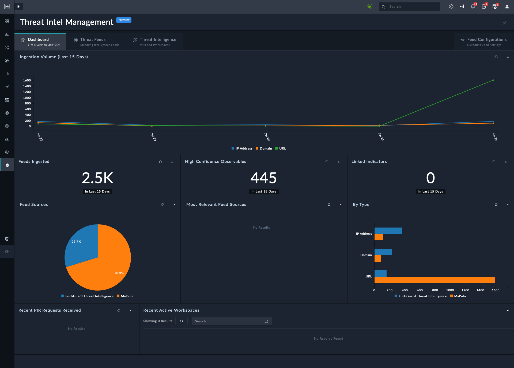

| [Home](../README.md) |
|----------------------|

# TIM Overview and ROI Dashboard

The **TIM Overview and ROI** dashboard gives Security Operations Center (SOC) analysts a visual summary of threat intelligence activity over the last 15 days. It combines ingestion metrics, observable confidence levels, and feed source analysis to help teams understand the value and coverage of their threat intelligence program.

At the top of the dashboard, the **Ingestion Volume (Last 15 Days)** chart plots different types of indicators over time. Each colored line corresponds to an observable type—network activity, IP addresses, file hashes (SHA256), domains, and URLs—showing how many were brought in on each day. Spikes or dips here quickly reveal trends in intelligence flow, such as an outbreak of malicious URLs or a quiet period for IP indicators.

Beneath the trend chart, several key metrics provide context:

- **Feeds Ingested** highlights the total number of indicators pulled in during the last 15 days.
- **High Confidence Observables** shows how many of those indicators were automatically classified as high fidelity, which can be prioritized for action.
- **Linked Indicators** indicates how many observables were associated with existing incidents or records, signaling direct operational relevance.

The **Feed Sources** panel uses a pie chart to illustrate where ingested data originated. In this example, FortiGuard Threat Intelligence is the sole source, but additional external or custom feeds would also appear here.

The **By Type** bar chart breaks down observables by category, letting analysts see which types dominate the intelligence stream. For example, a large number of URLs compared to file hashes may suggest increased phishing activity.

Two panels—**Most Relevant Feed Sources** and **Recent PIR Requests Received**—offer deeper insights when populated. “Most Relevant Feed Sources” ranks feeds by usefulness based on overlap with active investigations, while “Recent PIR Requests” lists any Priority Intelligence Requirements submitted by the organization.

Finally, **Recent Active Workspaces** tracks collaborative intelligence workspaces. This section helps analysts pick up where teams left off, but in this snapshot no active workspaces are recorded.

Together, these views give analysts both quantitative and qualitative measures of TIM performance, showing not just how much data is being ingested, but also how much of it is actionable and relevant to ongoing operations.

# Next Steps

| [Installation](./setup.md#installation) | [Configuration](./setup.md#configuration) | [Contents](./contents.md) |
|-----------------------------------------|-------------------------------------------|---------------------------|