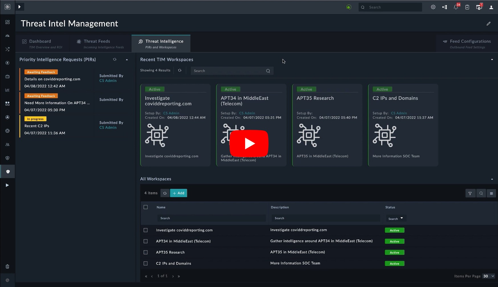

| [Home](../README.md) |
|----------------------|

# Usage

Welcome to the **Threat Intel Management (TIM)** Solution Pack usage guide. To make navigation easier, this content has been split into focused guides. Each page covers a distinct part of TIM functionality.

## Overview

FortiSOAR's **Threat Intel Management** Solution Pack brings Security Orchestration and Automated Response (SOAR) and Threat Intel Management (TIM) together by introducing advanced TIM capabilities within the SOAR platform.

|  |
|:---------------------------------------------------------------------------------------------------:|
|          [FortiSOAR Threat Intel Management](https://www.youtube.com/watch?v=vTvtHQxniVU)           |

### Threat Feed Management and FortiGuard Integration

Using ingestion-friendly integrations for multiple paid and open-source feeds, threat intelligence teams can manage data in a normalized, single pane of glass with the **Threat Feeds** module. Filters by confidence, TLP, severity, expiry, and datasets allow efficient control.

The solution also integrates FortiGuard intelligence with unlimited lookups and daily ingestion feeds (100 max in preview mode).

### Collaborative Framework

SOC members and stakeholders can raise **Priority Intelligence Requirement (PIR)** requests. Workspaces are created to align with the threat intelligence lifecycle: direction, collection, processing, analysis, dissemination, feedback.

Feeds, MITRE ATT&CK data, and automation combine to support in-depth contextual investigations.

### Sharing Threat Intelligence

- Generate and share reports with stakeholders.
- Provide feedback loops for PIRs.
- Share datasets via **STIX/TAXII** to external products such as FortiSIEM.

### Feed Relationship Indicators

The solution auto-links malicious feeds with indicators, optionally updating indicator reputation. Configurations exist for confidence, sightings, similarities, and more.

## Sections

- [Threat Intel Search](./threat-intel-search.md) &ndash; Query threat intelligence for domains, IPs, and other indicators of compromise, with CVE context, outbreak ties, confidence scoring, and hosting risk.
- [Feed Management](./feeds.md) &ndash; configuring, ingesting, filtering, and managing feeds.
  - [Threat Feed Rules](./threat-feed-rules.md) &ndash; specify rules to automate feed ingestion.
- [TAXII Integration](./taxii.md) &ndash; using TIM as a TAXII server and consuming datasets.
- [Examples](./examples.md) &ndash; step-by-step tutorial: exporting indicators to FortiGate.
- [FortiGuard Integration](./fortiguard.md) &ndash; ingesting reports from FortiGuard.
- [FortiRecon Integration](./fortirecon.md) &ndash; ingesting reports from FortiRecon ACI.
- [Threat Intelligence Workflow](./workflow.md) &ndash; PIR requests, workspaces, lifecycle, and reporting.

# Next Steps

| [Installation](./setup.md#installation) | [Configuration](./setup.md#configuration) | [Contents](./contents.md) |
|-----------------------------------------|-------------------------------------------|---------------------------|